# TITANIC 乘客生还率影响因素分析

> * 分析目的：通过kaggle上Titanic项目的训练集，探究‘ Titanic号上乘客生还率影响因素 ’，并进行进行描述性分析  
> * 分析思路：先观察对乘客生还率可能造成影响的因素组成，再对各影响因素单独进行分析，观察影响情况，  
&emsp;&emsp;&emsp;&emsp;&emsp;最后对各影响因素组合分析，分析各影响因素的影响程度，从而确定出影响乘客生还率的关键点


# 一. 数据预览


```python
#导入分析和可视化主要库
import numpy as np
import pandas as pd
import matplotlib.pyplot as plt
```


```python
#预设画布显示
% matplotlib inline
plt.rcParams['figure.figsize'] = (15, 8)
plt.rcParams['font.sans-serif'] =['SimHei']
plt.style.use('ggplot')
```


```python
#数据集内容为Titanic上的部分乘客相关数据
#读入数据集,先预览数据
ti=pd.read_csv('F:/titanic_dataset/train.csv',nrows=10)
print(ti)
```

       PassengerId  Survived  Pclass  \
    0            1         0       3   
    1            2         1       1   
    2            3         1       3   
    3            4         1       1   
    4            5         0       3   
    5            6         0       3   
    6            7         0       1   
    7            8         0       3   
    8            9         1       3   
    9           10         1       2   
    
                                                    Name     Sex   Age  SibSp  \
    0                            Braund, Mr. Owen Harris    male  22.0      1   
    1  Cumings, Mrs. John Bradley (Florence Briggs Th...  female  38.0      1   
    2                             Heikkinen, Miss. Laina  female  26.0      0   
    3       Futrelle, Mrs. Jacques Heath (Lily May Peel)  female  35.0      1   
    4                           Allen, Mr. William Henry    male  35.0      0   
    5                                   Moran, Mr. James    male   NaN      0   
    6                            McCarthy, Mr. Timothy J    male  54.0      0   
    7                     Palsson, Master. Gosta Leonard    male   2.0      3   
    8  Johnson, Mrs. Oscar W (Elisabeth Vilhelmina Berg)  female  27.0      0   
    9                Nasser, Mrs. Nicholas (Adele Achem)  female  14.0      1   
    
       Parch            Ticket     Fare Cabin Embarked  
    0      0         A/5 21171   7.2500   NaN        S  
    1      0          PC 17599  71.2833   C85        C  
    2      0  STON/O2. 3101282   7.9250   NaN        S  
    3      0            113803  53.1000  C123        S  
    4      0            373450   8.0500   NaN        S  
    5      0            330877   8.4583   NaN        Q  
    6      0             17463  51.8625   E46        S  
    7      1            349909  21.0750   NaN        S  
    8      2            347742  11.1333   NaN        S  
    9      0            237736  30.0708   NaN        C  
    


```python
#注意到其中PassengerId字段是按顺序排列的，可作为行索引
ti=pd.read_csv('F:/titanic_dataset/train.csv',index_col='PassengerId')
#概览数据
print(ti.shape)
ti.info()
```

    (891, 11)
    <class 'pandas.core.frame.DataFrame'>
    Int64Index: 891 entries, 1 to 891
    Data columns (total 11 columns):
    Survived    891 non-null int64
    Pclass      891 non-null int64
    Name        891 non-null object
    Sex         891 non-null object
    Age         714 non-null float64
    SibSp       891 non-null int64
    Parch       891 non-null int64
    Ticket      891 non-null object
    Fare        891 non-null float64
    Cabin       204 non-null object
    Embarked    889 non-null object
    dtypes: float64(2), int64(4), object(5)
    memory usage: 83.5+ KB
    

可以看到，此数据集有891条记录  
所有字段及含义为：
> PassengerId：  乘客ID  
Survived：   是否生还，**0为否，1为是**   
Pclass：   乘客舱位等级&emsp;记为1，2，3三个等级  
Name：    乘客姓名  
Sex：    乘客性别&emsp;男性记为male，女性为female  
Age：    乘客年龄  
SibSp：   乘客在船上的兄弟姐妹及配偶人数  
Parch：   乘客在船上的父母及孩子人数  
Ticket：   乘客船票号码  
Fare：    乘客船票价格  
Cabin：   乘客船舱号码  
Embarked：   乘客登船港口&emsp;记为C,Q,S三地

其中，年龄值仅有714条，部分缺失，船舱号码仅204条，大量缺失，登船港口889条，缺失2条  

对于字段简要分析：  
> Survived是要考察的指标  
Pclass,Sex,Age,SibSp,Parch可能是相关性比较大的影响因素  
Name,Cabin,Embarked是相关性比较小的影响因素  
Ticket,Fare体现在Pclass,Cabin中


```python
ti.describe()
```


<div>
<table border="1" class="dataframe">
  <thead>
    <tr style="text-align: right;">
      <th></th>
      <th>Survived</th>
      <th>Pclass</th>
      <th>Age</th>
      <th>SibSp</th>
      <th>Parch</th>
      <th>Fare</th>
    </tr>
  </thead>
  <tbody>
    <tr>
      <th>count</th>
      <td>891.000000</td>
      <td>891.000000</td>
      <td>714.000000</td>
      <td>891.000000</td>
      <td>891.000000</td>
      <td>891.000000</td>
    </tr>
    <tr>
      <th>mean</th>
      <td>0.383838</td>
      <td>2.308642</td>
      <td>29.699118</td>
      <td>0.523008</td>
      <td>0.381594</td>
      <td>32.204208</td>
    </tr>
    <tr>
      <th>std</th>
      <td>0.486592</td>
      <td>0.836071</td>
      <td>14.526497</td>
      <td>1.102743</td>
      <td>0.806057</td>
      <td>49.693429</td>
    </tr>
    <tr>
      <th>min</th>
      <td>0.000000</td>
      <td>1.000000</td>
      <td>0.420000</td>
      <td>0.000000</td>
      <td>0.000000</td>
      <td>0.000000</td>
    </tr>
    <tr>
      <th>25%</th>
      <td>0.000000</td>
      <td>2.000000</td>
      <td>20.125000</td>
      <td>0.000000</td>
      <td>0.000000</td>
      <td>7.910400</td>
    </tr>
    <tr>
      <th>50%</th>
      <td>0.000000</td>
      <td>3.000000</td>
      <td>28.000000</td>
      <td>0.000000</td>
      <td>0.000000</td>
      <td>14.454200</td>
    </tr>
    <tr>
      <th>75%</th>
      <td>1.000000</td>
      <td>3.000000</td>
      <td>38.000000</td>
      <td>1.000000</td>
      <td>0.000000</td>
      <td>31.000000</td>
    </tr>
    <tr>
      <th>max</th>
      <td>1.000000</td>
      <td>3.000000</td>
      <td>80.000000</td>
      <td>8.000000</td>
      <td>6.000000</td>
      <td>512.329200</td>
    </tr>
  </tbody>
</table>
</div>


从概览信息可以看出：  
* 乘客平均生还率仅38.38%
* 乘客平均年龄有29.70岁，最小的乘客0.42岁即4个月大，最大的乘客80岁
* 乘客平均票价仅32.20，而最高票价有512.33

# 二. 数据预处理


```python
#检查重复项
ti.duplicated().value_counts()
```


    False    891
    dtype: int64


```python
#检查是否缺失
ti.isnull().any()
```


    Survived    False
    Pclass      False
    Name        False
    Sex         False
    Age          True
    SibSp       False
    Parch       False
    Ticket      False
    Fare        False
    Cabin        True
    Embarked     True
    dtype: bool


```python
#检查缺失项数目
ti.isnull().sum()
```


    Survived      0
    Pclass        0
    Name          0
    Sex           0
    Age         177
    SibSp         0
    Parch         0
    Ticket        0
    Fare          0
    Cabin       687
    Embarked      2
    dtype: int64


对于age项部分缺失，有以下几种填充方案：  
1. 用年龄平均数填充
2. 用年龄中位数填充
3. 不同性别以各性别的平均数分开填充年龄缺失值


```python
ti['Age_case1']=ti['Age'].fillna(ti.Age.mean())    #以平均数填充
ti['Age_case2']=ti['Age'].fillna(ti.Age.median())  #以中位数填充

#各自以性别平均数来填充
ti['Age_case3']=ti.Age
age_groupby_sex=ti.groupby('Sex')['Age'].mean()
ti.loc[ti.Age_case3.isnull(),'Age_case3']=ti.loc[ti.Age_case3.isnull(),'Sex'].apply(lambda x:age_groupby_sex[x])

#不同方案填充完后年龄均值比较
ti[['Age','Age_case1','Age_case2','Age_case3']].mean()
```


    Age          29.699118
    Age_case1    29.699118
    Age_case2    29.361582
    Age_case3    29.736034
    dtype: float64


可以看到，中位数填充的比均值填充的平均年龄偏小，以性别分开填充的方式与均值填充的相当


```python
#通过直方图进行比较
ti[['Age_case1','Age_case2','Age_case3']].plot.hist(subplots=True,layout=(1,3),alpha=0.6,bins=20,grid=True)
```


    array([[<matplotlib.axes._subplots.AxesSubplot object at 0x000001F9185706D8>,
            <matplotlib.axes._subplots.AxesSubplot object at 0x000001F918B25198>,
            <matplotlib.axes._subplots.AxesSubplot object at 0x000001F918B4F2B0>]],
          dtype=object)


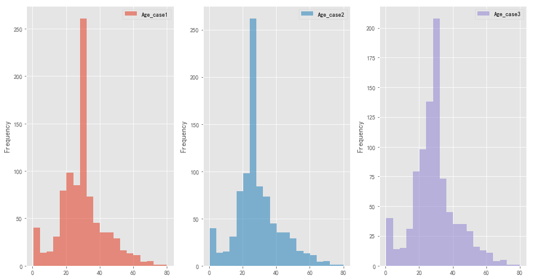


```python
#画在同一张图上对比更明显
ti[['Age_case1','Age_case2','Age_case3']].plot.hist(alpha=0.6,bins=20,grid=True)
```


    <matplotlib.axes._subplots.AxesSubplot at 0x1f918f2b940>


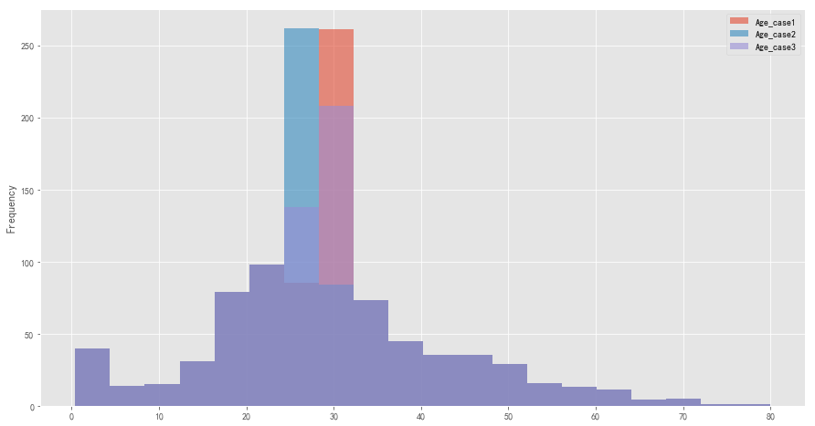


对比填充完后的情况，可以看出：  
    用均值填充后最高峰在30处，而中位数填充的在28-29处，而分性别填充的情况介于二者之间，参考意义更佳   
    故选用第三种方案填充年龄字段


```python
ti['Age']=ti['Age_case3']
ti.drop(['Age_case1','Age_case2','Age_case3'],axis=1,inplace=True)
```


```python
#处理embarked的缺失值，观察缺失项的其他信息
ti[ti.Embarked.isnull()].T
```


<div>
<table border="1" class="dataframe">
  <thead>
    <tr style="text-align: right;">
      <th>PassengerId</th>
      <th>62</th>
      <th>830</th>
    </tr>
  </thead>
  <tbody>
    <tr>
      <th>Survived</th>
      <td>1</td>
      <td>1</td>
    </tr>
    <tr>
      <th>Pclass</th>
      <td>1</td>
      <td>1</td>
    </tr>
    <tr>
      <th>Name</th>
      <td>Icard, Miss. Amelie</td>
      <td>Stone, Mrs. George Nelson (Martha Evelyn)</td>
    </tr>
    <tr>
      <th>Sex</th>
      <td>female</td>
      <td>female</td>
    </tr>
    <tr>
      <th>Age</th>
      <td>38</td>
      <td>62</td>
    </tr>
    <tr>
      <th>SibSp</th>
      <td>0</td>
      <td>0</td>
    </tr>
    <tr>
      <th>Parch</th>
      <td>0</td>
      <td>0</td>
    </tr>
    <tr>
      <th>Ticket</th>
      <td>113572</td>
      <td>113572</td>
    </tr>
    <tr>
      <th>Fare</th>
      <td>80</td>
      <td>80</td>
    </tr>
    <tr>
      <th>Cabin</th>
      <td>B28</td>
      <td>B28</td>
    </tr>
    <tr>
      <th>Embarked</th>
      <td>NaN</td>
      <td>NaN</td>
    </tr>
  </tbody>
</table>
</div>


可以看到，两名乘客的船舱等级、船舱号码、船票号码、船票价格都一样，可以认为是同一地方登船


```python
#再看不同等级舱位上船地点情况
ti[['Cabin','Pclass','Embarked']][(ti.Cabin.notnull()) & (ti.Pclass==3)]
```


<div>
<table border="1" class="dataframe">
  <thead>
    <tr style="text-align: right;">
      <th></th>
      <th>Cabin</th>
      <th>Pclass</th>
      <th>Embarked</th>
    </tr>
    <tr>
      <th>PassengerId</th>
      <th></th>
      <th></th>
      <th></th>
    </tr>
  </thead>
  <tbody>
    <tr>
      <th>11</th>
      <td>G6</td>
      <td>3</td>
      <td>S</td>
    </tr>
    <tr>
      <th>76</th>
      <td>F G73</td>
      <td>3</td>
      <td>S</td>
    </tr>
    <tr>
      <th>129</th>
      <td>F E69</td>
      <td>3</td>
      <td>C</td>
    </tr>
    <tr>
      <th>206</th>
      <td>G6</td>
      <td>3</td>
      <td>S</td>
    </tr>
    <tr>
      <th>252</th>
      <td>G6</td>
      <td>3</td>
      <td>S</td>
    </tr>
    <tr>
      <th>395</th>
      <td>G6</td>
      <td>3</td>
      <td>S</td>
    </tr>
    <tr>
      <th>430</th>
      <td>E10</td>
      <td>3</td>
      <td>S</td>
    </tr>
    <tr>
      <th>700</th>
      <td>F G63</td>
      <td>3</td>
      <td>S</td>
    </tr>
    <tr>
      <th>716</th>
      <td>F G73</td>
      <td>3</td>
      <td>S</td>
    </tr>
    <tr>
      <th>752</th>
      <td>E121</td>
      <td>3</td>
      <td>S</td>
    </tr>
    <tr>
      <th>777</th>
      <td>F38</td>
      <td>3</td>
      <td>Q</td>
    </tr>
    <tr>
      <th>824</th>
      <td>E121</td>
      <td>3</td>
      <td>S</td>
    </tr>
  </tbody>
</table>
</div>


```python
ti[['Cabin','Pclass','Embarked']][(ti.Cabin.notnull()) & (ti.Pclass==2)]
```


<div>
<table border="1" class="dataframe">
  <thead>
    <tr style="text-align: right;">
      <th></th>
      <th>Cabin</th>
      <th>Pclass</th>
      <th>Embarked</th>
    </tr>
    <tr>
      <th>PassengerId</th>
      <th></th>
      <th></th>
      <th></th>
    </tr>
  </thead>
  <tbody>
    <tr>
      <th>22</th>
      <td>D56</td>
      <td>2</td>
      <td>S</td>
    </tr>
    <tr>
      <th>67</th>
      <td>F33</td>
      <td>2</td>
      <td>S</td>
    </tr>
    <tr>
      <th>124</th>
      <td>E101</td>
      <td>2</td>
      <td>S</td>
    </tr>
    <tr>
      <th>149</th>
      <td>F2</td>
      <td>2</td>
      <td>S</td>
    </tr>
    <tr>
      <th>184</th>
      <td>F4</td>
      <td>2</td>
      <td>S</td>
    </tr>
    <tr>
      <th>194</th>
      <td>F2</td>
      <td>2</td>
      <td>S</td>
    </tr>
    <tr>
      <th>293</th>
      <td>D</td>
      <td>2</td>
      <td>C</td>
    </tr>
    <tr>
      <th>304</th>
      <td>E101</td>
      <td>2</td>
      <td>Q</td>
    </tr>
    <tr>
      <th>328</th>
      <td>D</td>
      <td>2</td>
      <td>S</td>
    </tr>
    <tr>
      <th>341</th>
      <td>F2</td>
      <td>2</td>
      <td>S</td>
    </tr>
    <tr>
      <th>346</th>
      <td>F33</td>
      <td>2</td>
      <td>S</td>
    </tr>
    <tr>
      <th>474</th>
      <td>D</td>
      <td>2</td>
      <td>C</td>
    </tr>
    <tr>
      <th>517</th>
      <td>F33</td>
      <td>2</td>
      <td>S</td>
    </tr>
    <tr>
      <th>619</th>
      <td>F4</td>
      <td>2</td>
      <td>S</td>
    </tr>
    <tr>
      <th>718</th>
      <td>E101</td>
      <td>2</td>
      <td>S</td>
    </tr>
    <tr>
      <th>773</th>
      <td>E77</td>
      <td>2</td>
      <td>S</td>
    </tr>
  </tbody>
</table>
</div>


```python
ti[['Cabin','Pclass','Embarked']][(ti.Cabin.notnull()) & (ti.Pclass==1)]
```


<div>
<table border="1" class="dataframe">
  <thead>
    <tr style="text-align: right;">
      <th></th>
      <th>Cabin</th>
      <th>Pclass</th>
      <th>Embarked</th>
    </tr>
    <tr>
      <th>PassengerId</th>
      <th></th>
      <th></th>
      <th></th>
    </tr>
  </thead>
  <tbody>
    <tr>
      <th>2</th>
      <td>C85</td>
      <td>1</td>
      <td>C</td>
    </tr>
    <tr>
      <th>4</th>
      <td>C123</td>
      <td>1</td>
      <td>S</td>
    </tr>
    <tr>
      <th>7</th>
      <td>E46</td>
      <td>1</td>
      <td>S</td>
    </tr>
    <tr>
      <th>12</th>
      <td>C103</td>
      <td>1</td>
      <td>S</td>
    </tr>
    <tr>
      <th>24</th>
      <td>A6</td>
      <td>1</td>
      <td>S</td>
    </tr>
    <tr>
      <th>28</th>
      <td>C23 C25 C27</td>
      <td>1</td>
      <td>S</td>
    </tr>
    <tr>
      <th>32</th>
      <td>B78</td>
      <td>1</td>
      <td>C</td>
    </tr>
    <tr>
      <th>53</th>
      <td>D33</td>
      <td>1</td>
      <td>C</td>
    </tr>
    <tr>
      <th>55</th>
      <td>B30</td>
      <td>1</td>
      <td>C</td>
    </tr>
    <tr>
      <th>56</th>
      <td>C52</td>
      <td>1</td>
      <td>S</td>
    </tr>
    <tr>
      <th>62</th>
      <td>B28</td>
      <td>1</td>
      <td>NaN</td>
    </tr>
    <tr>
      <th>63</th>
      <td>C83</td>
      <td>1</td>
      <td>S</td>
    </tr>
    <tr>
      <th>89</th>
      <td>C23 C25 C27</td>
      <td>1</td>
      <td>S</td>
    </tr>
    <tr>
      <th>93</th>
      <td>E31</td>
      <td>1</td>
      <td>S</td>
    </tr>
    <tr>
      <th>97</th>
      <td>A5</td>
      <td>1</td>
      <td>C</td>
    </tr>
    <tr>
      <th>98</th>
      <td>D10 D12</td>
      <td>1</td>
      <td>C</td>
    </tr>
    <tr>
      <th>103</th>
      <td>D26</td>
      <td>1</td>
      <td>S</td>
    </tr>
    <tr>
      <th>111</th>
      <td>C110</td>
      <td>1</td>
      <td>S</td>
    </tr>
    <tr>
      <th>119</th>
      <td>B58 B60</td>
      <td>1</td>
      <td>C</td>
    </tr>
    <tr>
      <th>125</th>
      <td>D26</td>
      <td>1</td>
      <td>S</td>
    </tr>
    <tr>
      <th>137</th>
      <td>D47</td>
      <td>1</td>
      <td>S</td>
    </tr>
    <tr>
      <th>138</th>
      <td>C123</td>
      <td>1</td>
      <td>S</td>
    </tr>
    <tr>
      <th>140</th>
      <td>B86</td>
      <td>1</td>
      <td>C</td>
    </tr>
    <tr>
      <th>152</th>
      <td>C2</td>
      <td>1</td>
      <td>S</td>
    </tr>
    <tr>
      <th>167</th>
      <td>E33</td>
      <td>1</td>
      <td>S</td>
    </tr>
    <tr>
      <th>171</th>
      <td>B19</td>
      <td>1</td>
      <td>S</td>
    </tr>
    <tr>
      <th>175</th>
      <td>A7</td>
      <td>1</td>
      <td>C</td>
    </tr>
    <tr>
      <th>178</th>
      <td>C49</td>
      <td>1</td>
      <td>C</td>
    </tr>
    <tr>
      <th>186</th>
      <td>A32</td>
      <td>1</td>
      <td>S</td>
    </tr>
    <tr>
      <th>195</th>
      <td>B4</td>
      <td>1</td>
      <td>C</td>
    </tr>
    <tr>
      <th>...</th>
      <td>...</td>
      <td>...</td>
      <td>...</td>
    </tr>
    <tr>
      <th>742</th>
      <td>C46</td>
      <td>1</td>
      <td>S</td>
    </tr>
    <tr>
      <th>743</th>
      <td>B57 B59 B63 B66</td>
      <td>1</td>
      <td>C</td>
    </tr>
    <tr>
      <th>746</th>
      <td>B22</td>
      <td>1</td>
      <td>S</td>
    </tr>
    <tr>
      <th>749</th>
      <td>D30</td>
      <td>1</td>
      <td>S</td>
    </tr>
    <tr>
      <th>760</th>
      <td>B77</td>
      <td>1</td>
      <td>S</td>
    </tr>
    <tr>
      <th>764</th>
      <td>B96 B98</td>
      <td>1</td>
      <td>S</td>
    </tr>
    <tr>
      <th>766</th>
      <td>D11</td>
      <td>1</td>
      <td>S</td>
    </tr>
    <tr>
      <th>780</th>
      <td>B3</td>
      <td>1</td>
      <td>S</td>
    </tr>
    <tr>
      <th>782</th>
      <td>B20</td>
      <td>1</td>
      <td>S</td>
    </tr>
    <tr>
      <th>783</th>
      <td>D6</td>
      <td>1</td>
      <td>S</td>
    </tr>
    <tr>
      <th>790</th>
      <td>B82 B84</td>
      <td>1</td>
      <td>C</td>
    </tr>
    <tr>
      <th>797</th>
      <td>D17</td>
      <td>1</td>
      <td>S</td>
    </tr>
    <tr>
      <th>803</th>
      <td>B96 B98</td>
      <td>1</td>
      <td>S</td>
    </tr>
    <tr>
      <th>807</th>
      <td>A36</td>
      <td>1</td>
      <td>S</td>
    </tr>
    <tr>
      <th>810</th>
      <td>E8</td>
      <td>1</td>
      <td>S</td>
    </tr>
    <tr>
      <th>816</th>
      <td>B102</td>
      <td>1</td>
      <td>S</td>
    </tr>
    <tr>
      <th>821</th>
      <td>B69</td>
      <td>1</td>
      <td>S</td>
    </tr>
    <tr>
      <th>830</th>
      <td>B28</td>
      <td>1</td>
      <td>NaN</td>
    </tr>
    <tr>
      <th>836</th>
      <td>E49</td>
      <td>1</td>
      <td>C</td>
    </tr>
    <tr>
      <th>840</th>
      <td>C47</td>
      <td>1</td>
      <td>C</td>
    </tr>
    <tr>
      <th>850</th>
      <td>C92</td>
      <td>1</td>
      <td>C</td>
    </tr>
    <tr>
      <th>854</th>
      <td>D28</td>
      <td>1</td>
      <td>S</td>
    </tr>
    <tr>
      <th>858</th>
      <td>E17</td>
      <td>1</td>
      <td>S</td>
    </tr>
    <tr>
      <th>863</th>
      <td>D17</td>
      <td>1</td>
      <td>S</td>
    </tr>
    <tr>
      <th>868</th>
      <td>A24</td>
      <td>1</td>
      <td>S</td>
    </tr>
    <tr>
      <th>872</th>
      <td>D35</td>
      <td>1</td>
      <td>S</td>
    </tr>
    <tr>
      <th>873</th>
      <td>B51 B53 B55</td>
      <td>1</td>
      <td>S</td>
    </tr>
    <tr>
      <th>880</th>
      <td>C50</td>
      <td>1</td>
      <td>C</td>
    </tr>
    <tr>
      <th>888</th>
      <td>B42</td>
      <td>1</td>
      <td>S</td>
    </tr>
    <tr>
      <th>890</th>
      <td>C148</td>
      <td>1</td>
      <td>C</td>
    </tr>
  </tbody>
</table>
<p>176 rows × 3 columns</p>
</div>


可以看出，按照英文字母顺序，船舱号码开头英文字母越往后的船舱等级越低，即A-C，D-E，F-G为多数一等，二等，三等舱位船舱


```python
#根据船舱名称B开头的上船地点推断
cabin_b=ti['Cabin'].str.startswith('B')
ti[cabin_b==True][['Cabin','Embarked','Pclass']].sort_values(by='Cabin')
```


<div>
<table border="1" class="dataframe">
  <thead>
    <tr style="text-align: right;">
      <th></th>
      <th>Cabin</th>
      <th>Embarked</th>
      <th>Pclass</th>
    </tr>
    <tr>
      <th>PassengerId</th>
      <th></th>
      <th></th>
      <th></th>
    </tr>
  </thead>
  <tbody>
    <tr>
      <th>738</th>
      <td>B101</td>
      <td>C</td>
      <td>1</td>
    </tr>
    <tr>
      <th>816</th>
      <td>B102</td>
      <td>S</td>
      <td>1</td>
    </tr>
    <tr>
      <th>524</th>
      <td>B18</td>
      <td>C</td>
      <td>1</td>
    </tr>
    <tr>
      <th>330</th>
      <td>B18</td>
      <td>C</td>
      <td>1</td>
    </tr>
    <tr>
      <th>171</th>
      <td>B19</td>
      <td>S</td>
      <td>1</td>
    </tr>
    <tr>
      <th>691</th>
      <td>B20</td>
      <td>S</td>
      <td>1</td>
    </tr>
    <tr>
      <th>782</th>
      <td>B20</td>
      <td>S</td>
      <td>1</td>
    </tr>
    <tr>
      <th>541</th>
      <td>B22</td>
      <td>S</td>
      <td>1</td>
    </tr>
    <tr>
      <th>746</th>
      <td>B22</td>
      <td>S</td>
      <td>1</td>
    </tr>
    <tr>
      <th>830</th>
      <td>B28</td>
      <td>NaN</td>
      <td>1</td>
    </tr>
    <tr>
      <th>62</th>
      <td>B28</td>
      <td>NaN</td>
      <td>1</td>
    </tr>
    <tr>
      <th>780</th>
      <td>B3</td>
      <td>S</td>
      <td>1</td>
    </tr>
    <tr>
      <th>55</th>
      <td>B30</td>
      <td>C</td>
      <td>1</td>
    </tr>
    <tr>
      <th>642</th>
      <td>B35</td>
      <td>C</td>
      <td>1</td>
    </tr>
    <tr>
      <th>370</th>
      <td>B35</td>
      <td>C</td>
      <td>1</td>
    </tr>
    <tr>
      <th>488</th>
      <td>B37</td>
      <td>C</td>
      <td>1</td>
    </tr>
    <tr>
      <th>537</th>
      <td>B38</td>
      <td>S</td>
      <td>1</td>
    </tr>
    <tr>
      <th>540</th>
      <td>B39</td>
      <td>C</td>
      <td>1</td>
    </tr>
    <tr>
      <th>195</th>
      <td>B4</td>
      <td>C</td>
      <td>1</td>
    </tr>
    <tr>
      <th>588</th>
      <td>B41</td>
      <td>C</td>
      <td>1</td>
    </tr>
    <tr>
      <th>888</th>
      <td>B42</td>
      <td>S</td>
      <td>1</td>
    </tr>
    <tr>
      <th>292</th>
      <td>B49</td>
      <td>C</td>
      <td>1</td>
    </tr>
    <tr>
      <th>485</th>
      <td>B49</td>
      <td>C</td>
      <td>1</td>
    </tr>
    <tr>
      <th>690</th>
      <td>B5</td>
      <td>S</td>
      <td>1</td>
    </tr>
    <tr>
      <th>731</th>
      <td>B5</td>
      <td>S</td>
      <td>1</td>
    </tr>
    <tr>
      <th>633</th>
      <td>B50</td>
      <td>C</td>
      <td>1</td>
    </tr>
    <tr>
      <th>873</th>
      <td>B51 B53 B55</td>
      <td>S</td>
      <td>1</td>
    </tr>
    <tr>
      <th>680</th>
      <td>B51 B53 B55</td>
      <td>C</td>
      <td>1</td>
    </tr>
    <tr>
      <th>312</th>
      <td>B57 B59 B63 B66</td>
      <td>C</td>
      <td>1</td>
    </tr>
    <tr>
      <th>743</th>
      <td>B57 B59 B63 B66</td>
      <td>C</td>
      <td>1</td>
    </tr>
    <tr>
      <th>119</th>
      <td>B58 B60</td>
      <td>C</td>
      <td>1</td>
    </tr>
    <tr>
      <th>300</th>
      <td>B58 B60</td>
      <td>C</td>
      <td>1</td>
    </tr>
    <tr>
      <th>821</th>
      <td>B69</td>
      <td>S</td>
      <td>1</td>
    </tr>
    <tr>
      <th>672</th>
      <td>B71</td>
      <td>S</td>
      <td>1</td>
    </tr>
    <tr>
      <th>521</th>
      <td>B73</td>
      <td>S</td>
      <td>1</td>
    </tr>
    <tr>
      <th>258</th>
      <td>B77</td>
      <td>S</td>
      <td>1</td>
    </tr>
    <tr>
      <th>760</th>
      <td>B77</td>
      <td>S</td>
      <td>1</td>
    </tr>
    <tr>
      <th>32</th>
      <td>B78</td>
      <td>C</td>
      <td>1</td>
    </tr>
    <tr>
      <th>505</th>
      <td>B79</td>
      <td>S</td>
      <td>1</td>
    </tr>
    <tr>
      <th>196</th>
      <td>B80</td>
      <td>C</td>
      <td>1</td>
    </tr>
    <tr>
      <th>790</th>
      <td>B82 B84</td>
      <td>C</td>
      <td>1</td>
    </tr>
    <tr>
      <th>140</th>
      <td>B86</td>
      <td>C</td>
      <td>1</td>
    </tr>
    <tr>
      <th>264</th>
      <td>B94</td>
      <td>S</td>
      <td>1</td>
    </tr>
    <tr>
      <th>803</th>
      <td>B96 B98</td>
      <td>S</td>
      <td>1</td>
    </tr>
    <tr>
      <th>391</th>
      <td>B96 B98</td>
      <td>S</td>
      <td>1</td>
    </tr>
    <tr>
      <th>436</th>
      <td>B96 B98</td>
      <td>S</td>
      <td>1</td>
    </tr>
    <tr>
      <th>764</th>
      <td>B96 B98</td>
      <td>S</td>
      <td>1</td>
    </tr>
  </tbody>
</table>
</div>


```python
ti['Embarked'][cabin_b==True].value_counts()
```


    S    23
    C    22
    Name: Embarked, dtype: int64


可见B开头船舱号码上船地点在C和S两地，但数量相当，还需进一步判断


```python
#考虑用船票价格分布来推断可能上船地点，使用箱线图表征
ti.boxplot(column='Fare',by=['Pclass','Embarked'])
plt.title('不同船舱等级、登船港口的船票价格分布')
```


    Text(0.5, 1.0, '不同船舱等级、登船港口的船票价格分布')


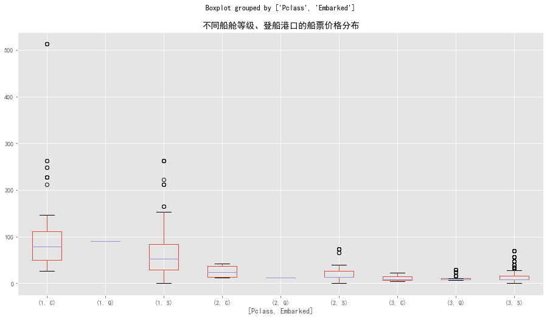


可以看出，一等舱在C地登船大的平均票价明显比S地登船要高，更接近100，而缺失记录的票价为80  
故而大概率是C地登船


```python
ti['Embarked'].fillna('C',inplace=True)
ti['Embarked'].isnull().value_counts()
```


    False    891
    Name: Embarked, dtype: int64


```python
#cabin项缺失较多，难以填充，可删除
ti.drop(['Cabin'],axis=1,inplace=True)
```


```python
#SibSp,Parchz字段表示乘客同行的家人和亲友数，可合成后来观察
ti['Together']=ti['SibSp']+ti['Parch']
```


```python
#最后删除相关性小且难以分析的字段，Name,Ticket
ti.drop(['Name','Ticket'],axis=1,inplace=True)
ti.head()
```


<div>
<table border="1" class="dataframe">
  <thead>
    <tr style="text-align: right;">
      <th></th>
      <th>Survived</th>
      <th>Pclass</th>
      <th>Sex</th>
      <th>Age</th>
      <th>SibSp</th>
      <th>Parch</th>
      <th>Fare</th>
      <th>Embarked</th>
      <th>Together</th>
    </tr>
    <tr>
      <th>PassengerId</th>
      <th></th>
      <th></th>
      <th></th>
      <th></th>
      <th></th>
      <th></th>
      <th></th>
      <th></th>
      <th></th>
    </tr>
  </thead>
  <tbody>
    <tr>
      <th>1</th>
      <td>0</td>
      <td>3</td>
      <td>male</td>
      <td>22.0</td>
      <td>1</td>
      <td>0</td>
      <td>7.2500</td>
      <td>S</td>
      <td>1</td>
    </tr>
    <tr>
      <th>2</th>
      <td>1</td>
      <td>1</td>
      <td>female</td>
      <td>38.0</td>
      <td>1</td>
      <td>0</td>
      <td>71.2833</td>
      <td>C</td>
      <td>1</td>
    </tr>
    <tr>
      <th>3</th>
      <td>1</td>
      <td>3</td>
      <td>female</td>
      <td>26.0</td>
      <td>0</td>
      <td>0</td>
      <td>7.9250</td>
      <td>S</td>
      <td>0</td>
    </tr>
    <tr>
      <th>4</th>
      <td>1</td>
      <td>1</td>
      <td>female</td>
      <td>35.0</td>
      <td>1</td>
      <td>0</td>
      <td>53.1000</td>
      <td>S</td>
      <td>1</td>
    </tr>
    <tr>
      <th>5</th>
      <td>0</td>
      <td>3</td>
      <td>male</td>
      <td>35.0</td>
      <td>0</td>
      <td>0</td>
      <td>8.0500</td>
      <td>S</td>
      <td>0</td>
    </tr>
  </tbody>
</table>
</div>


# 三. 数据分析

## 1. 变量组成分析


```python
#定义画图函数，分析各字段内部组成
def base_plot(col,title):
    ax1=plt.subplot2grid(shape=(1,2),loc=(0,0))
    ax2=plt.subplot2grid(shape=(1,2),loc=(0,1))
    col.value_counts().plot.bar(ax=ax1,legend=True,grid=True)
    ax1.set_title('%s数量分布情况'%title)
    col.value_counts().plot.pie(ax=ax2,autopct='%.2f%%',startangle=90,legend=True)
    ax2.set_title('%s数量分布占比'%title)
```


```python
base_plot(ti.Pclass,'各船舱等级')
```


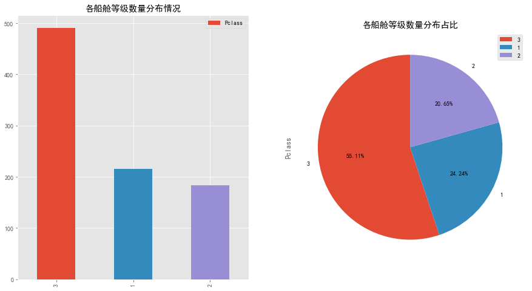


可以看到，三等船舱的乘客最多，占比达到了55.11%，二等舱和一等舱的乘客数相当


```python
base_plot(ti.Sex,'各性别')
```


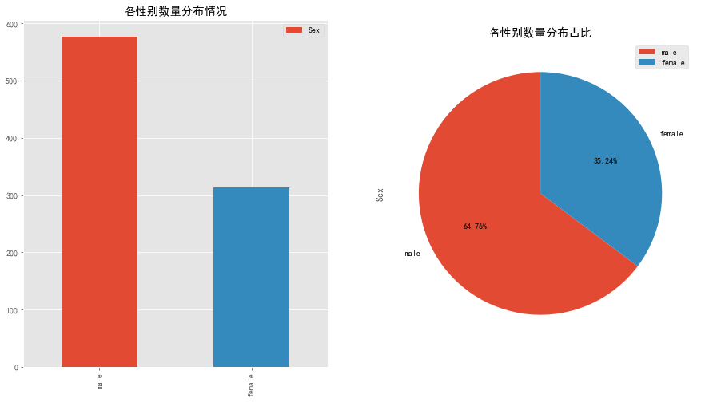


可以看到，乘客中男性明显多于女性，男性乘客占比64.76%，约为女性乘客的两倍


```python
base_plot(ti.Together,'各同行亲友数')
```


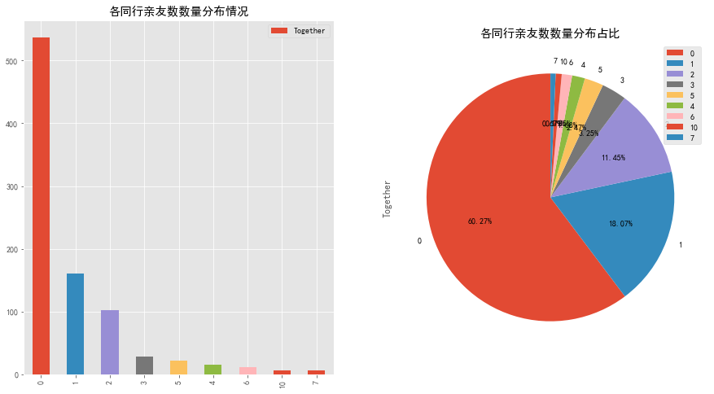


可以看到，独自出行的乘客人数要比亲友同行的乘客多，独自出行的乘客占比达到了60.27%  
亲友同行的乘客中，同行人数为2个以内的人数最多，3个以上的很少


```python
base_plot(ti.Embarked,'各登船港口')
```


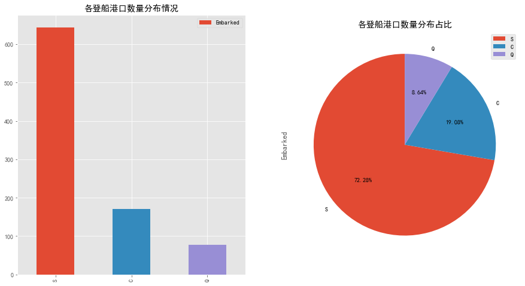


可以看到，大多数乘客都是从S地登船，占比达到了72.44%，C地登船和Q地登船的乘客分别只占了18.09%和8.66%


```python
#对于连续的字段，如Age，Fare，先分箱再画图
ti['Age_cut']=pd.cut(ti.Age,bins=range(0,81,10))
base_plot(ti.Age_cut,'各年龄段')
plt.legend(())
```


    <matplotlib.legend.Legend at 0x1f9199adf98>


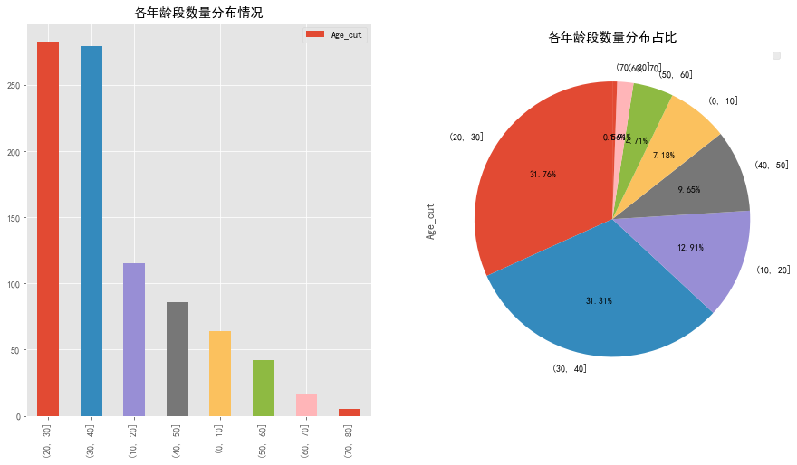


可以看到，20-30年龄段的乘客最多，占比有32.21%，其次是30-40年龄段，占比有21.71%，接着是10-20年龄段，占比有16.11%  
即乘客中10-40年龄段的人数占绝大部分


```python
ti['Fare_cut']=pd.cut(ti.Fare,bins=[0,50,100,200,600],right=False)
base_plot(ti.Fare_cut,'各票价区间')
plt.legend(())
```


    <matplotlib.legend.Legend at 0x1f919c4a898>


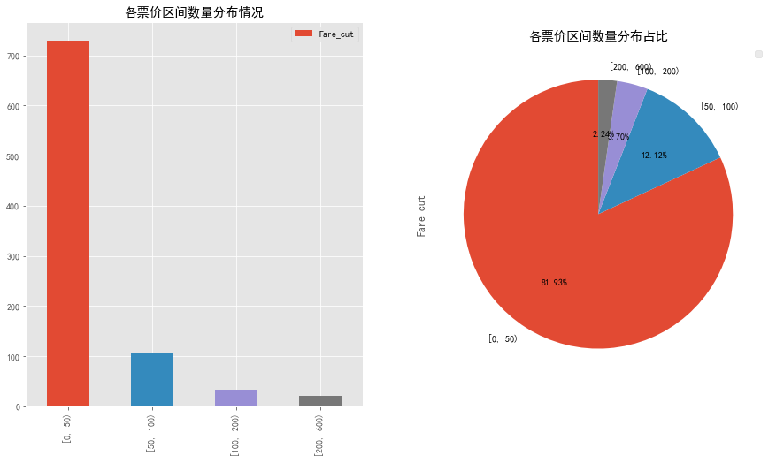


可以看到，票价在50以下的乘客占绝大多数，占比达到81.93%


```python
#也可用直方图表示年龄及票价分布
ti[['Age']].plot.hist(grid=True,bins=20,alpha=0.7,title='乘客年龄分布情况')
```


    <matplotlib.axes._subplots.AxesSubplot at 0x1f919c01048>


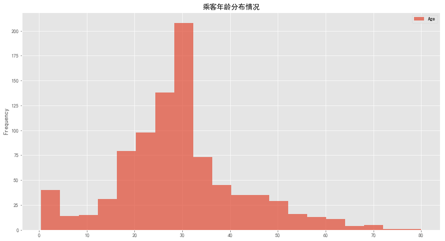


可以看出，乘客年龄在10-50的占了绝大多数


```python
ti[['Fare']].plot.hist(grid=True,bins=20,title='乘客票价分布情况')
```


    <matplotlib.axes._subplots.AxesSubplot at 0x1f91a28fcc0>


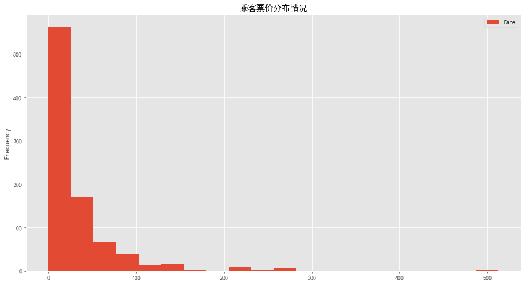


可以看出，乘客票价多在50以下，票价100以内的乘客占了绝大多数，票价100以上的乘客寥寥无几，但有个别乘客票价达到了500

## 2. 单变量分析


```python
#定义画图函数，分析单个字段对指标的影响
def one_plot(col,title):
    ax1=plt.subplot2grid(shape=(1,2),loc=(0,0))
    ax2=plt.subplot2grid(shape=(1,2),loc=(0,1))
    ti.groupby([col,'Survived'])['Survived'].count().unstack().plot.bar(ax=ax1,legend=True,grid=True)
    ax1.set_title('%s生还情况对比'%title)
    ti.groupby(col)['Survived'].mean().plot.bar(ax=ax2,legend=True,grid=True)
    ax2.set_title('%s生还率对比'%title)
```


```python
one_plot('Pclass','不同船舱等级')
plt.yticks(np.linspace(0,0.7,10,endpoint=True))
```


    ([<matplotlib.axis.YTick at 0x1f91a7034e0>,
      <matplotlib.axis.YTick at 0x1f91a6fed68>,
      <matplotlib.axis.YTick at 0x1f91a755128>,
      <matplotlib.axis.YTick at 0x1f91a766710>,
      <matplotlib.axis.YTick at 0x1f91a75fe48>,
      <matplotlib.axis.YTick at 0x1f91a766c50>,
      <matplotlib.axis.YTick at 0x1f91a766160>,
      <matplotlib.axis.YTick at 0x1f91a770400>,
      <matplotlib.axis.YTick at 0x1f91a6cd8d0>,
      <matplotlib.axis.YTick at 0x1f91a770e10>],
     <a list of 10 Text yticklabel objects>)


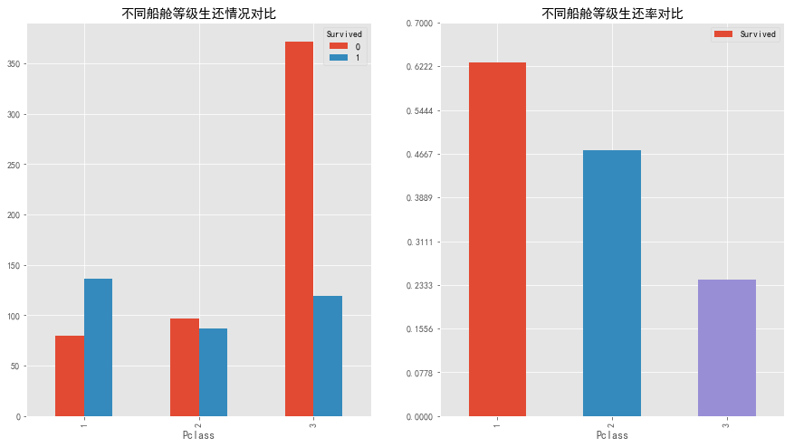


可以看到，乘客船舱等级对生还率影响明显，船舱等级越高，乘客生还率越高  
其中，一等舱的生还率最高，略超过62.2%，二等舱约46.7%，三等舱则仅有约23.3%  
而三等舱人数最多，多数未生还，未生还人数超过350人


```python
one_plot('Sex','不同性别')
plt.yticks(np.linspace(0,0.8,10,endpoint=True))
```


    ([<matplotlib.axis.YTick at 0x1f91a7dcf98>,
      <matplotlib.axis.YTick at 0x1f91a7dc860>,
      <matplotlib.axis.YTick at 0x1f91a839f28>,
      <matplotlib.axis.YTick at 0x1f91a8393c8>,
      <matplotlib.axis.YTick at 0x1f91a820940>,
      <matplotlib.axis.YTick at 0x1f91a841828>,
      <matplotlib.axis.YTick at 0x1f91a841e48>,
      <matplotlib.axis.YTick at 0x1f91a8493c8>,
      <matplotlib.axis.YTick at 0x1f91a849908>,
      <matplotlib.axis.YTick at 0x1f91a808f60>],
     <a list of 10 Text yticklabel objects>)


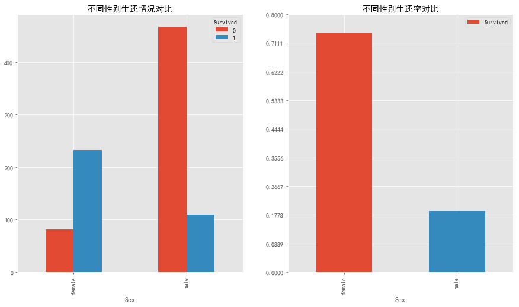


可以看到，乘客性别对生还率影响明显，女性乘客生还率大大高于男性  
女性生还率略超过71.1%，而男性生还率则仅有约17.8%  
未生还人数上，女性未生还人数不到100人，而男性未生还人数超过400人


```python
one_plot('Together','不同同行亲友数')
plt.yticks(np.linspace(0,0.8,20,endpoint=True))
```


    ([<matplotlib.axis.YTick at 0x1f91a8af240>,
      <matplotlib.axis.YTick at 0x1f91a8a8b00>,
      <matplotlib.axis.YTick at 0x1f91a91d0b8>,
      <matplotlib.axis.YTick at 0x1f91ab1c898>,
      <matplotlib.axis.YTick at 0x1f91ab240b8>,
      <matplotlib.axis.YTick at 0x1f91ab24588>,
      <matplotlib.axis.YTick at 0x1f91ab24ac8>,
      <matplotlib.axis.YTick at 0x1f91ab24940>,
      <matplotlib.axis.YTick at 0x1f91ab1c9b0>,
      <matplotlib.axis.YTick at 0x1f91a8f5f98>,
      <matplotlib.axis.YTick at 0x1f91a8cd0f0>,
      <matplotlib.axis.YTick at 0x1f91a8cd550>,
      <matplotlib.axis.YTick at 0x1f91a8cda58>,
      <matplotlib.axis.YTick at 0x1f91a8cde80>,
      <matplotlib.axis.YTick at 0x1f91ab39518>,
      <matplotlib.axis.YTick at 0x1f91a8cda20>,
      <matplotlib.axis.YTick at 0x1f91ab14828>,
      <matplotlib.axis.YTick at 0x1f91ab39908>,
      <matplotlib.axis.YTick at 0x1f91ab39e48>,
      <matplotlib.axis.YTick at 0x1f91ab443c8>],
     <a list of 20 Text yticklabel objects>)


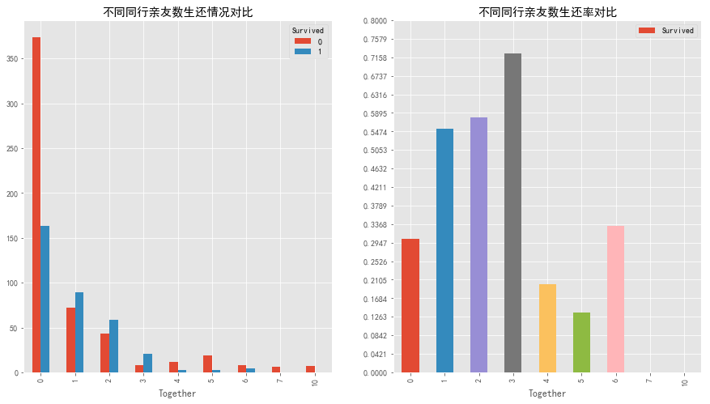


可以看到，亲友同行人数对生还率也有一定影响，亲友同行人数为3个的乘客生还率最高，其次是2个和1个，生还率分别约71.6%，58.9% ，54.7%  
而独自出行的乘客生还率仅有约29.5%  
亲友同行3个以上的乘客生还率明显下降  
但因为亲友同行人数3个或3个以上的人数较少，参考性有限  
着重考虑亲友同行人数为1或2个时，可以认为，有同行亲友的乘客生还率普遍高于独自出行的乘客  
未生还人数上，亲友同行的乘客未生还人数均少于100人，而独自出行的乘客未生还人数超过350人  
可以合理解释：有亲友同行在这种情况下能得到更多的帮助，但亲友数太多，可能导致因救援资源不足部分亲友主动放弃生还机会


```python
one_plot('Age_cut','不同年龄段')
```


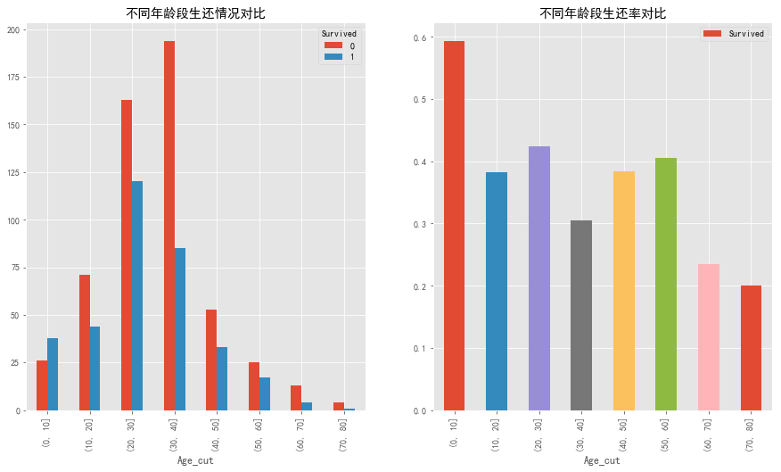


可以看到，年龄对乘客生还率也有一定影响，其中，年龄在0-10的乘客生还率最高，达到约60%  
60-80年龄段生还率较低，除了这两个年龄段，其余年龄段生还率相差不大，都在40%上下  
20-30年龄段的未生还人数最多，超过140人  
可以合理解释：年龄小的婴儿，儿童优先救援，而年长一辈可能将生还机会让给年轻一辈的


```python
one_plot('Embarked','不同登船港口')
```


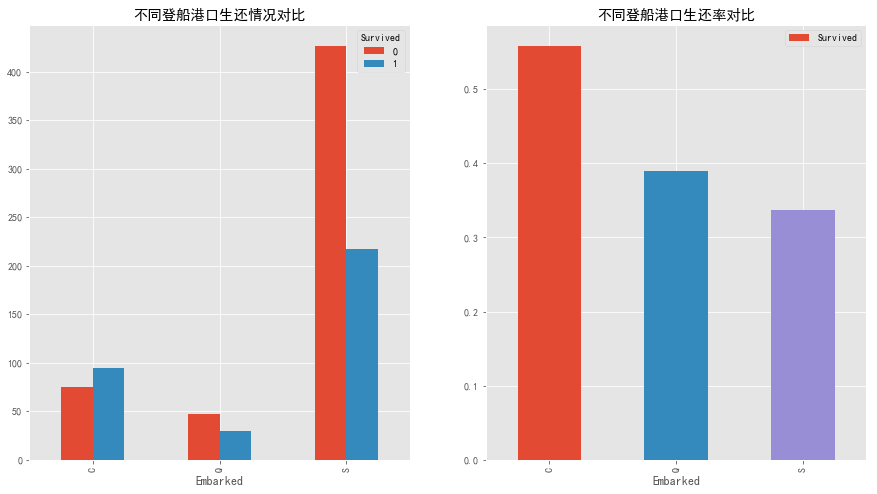


可以看到，S地登船的乘客人数最多，C/Q登船的人数较少，生还率上来看有所差距，但由于人数不均，参考意义较小

## 3. 双变量分析


```python
#ti.groupby(['Pclass','Sex','Survived'])['Survived'].count().unstack([-2,-1]).plot.bar(legend=True,grid=True)
#定义画图函数，分析两个字段对指标的共同影响及影响程度
def two_plot(col1,col2,title1,title2):
 
    fig,[[ax1,ax2],[ax3,ax4]]=plt.subplots(nrows=2,ncols=2)
    pd.crosstab([ti['%s'%col1],ti['%s'%col2]],[ti.Survived]).plot.barh(ax=ax1,stacked=True,grid=True)
    pd.crosstab([ti['%s'%col2],ti['%s'%col1]],[ti.Survived]).plot.barh(ax=ax2,stacked=True,grid=True)
    ax1.set_title('不同%s、%s下的生还情况对比'%(title1,title2))
    ax2.set_title('不同%s、%s下的生还情况对比'%(title1,title2))
    
    ti.pivot_table(values='Survived',index=col1,columns=col2,aggfunc='mean').plot.bar(ax=ax3,grid=True)
    ti.pivot_table(values='Survived',index=ti['%s'%col2],columns=ti['%s'%col1],aggfunc='mean').plot.bar(ax=ax4,grid=True)
    ax3.set_title('不同%s、%s下的生还率对比'%(title1,title2))
    ax4.set_title('不同%s、%s下的生还率对比'%(title1,title2))
    
```


```python
#先探究乘客船舱等级与性别对生还率的影响
two_plot('Pclass','Sex','船舱等级','性别')
```


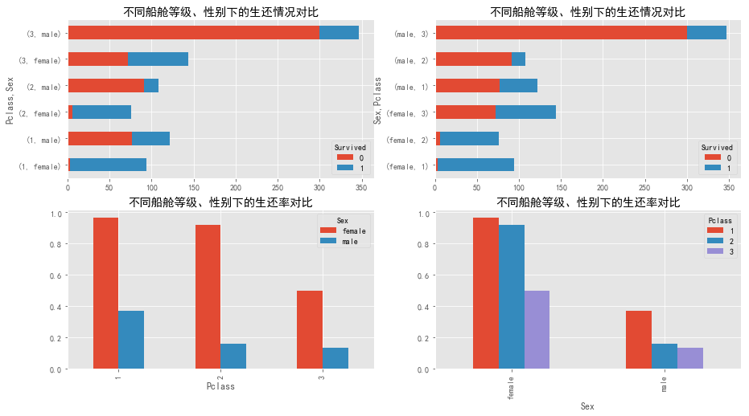


可以看到，不论是哪个船舱等级，女性的生还率都远远高于男性  
而同一性别时，船舱等级越高生还率也越高  
一等舱和二等舱的女性生还率超过80%，二等舱和三等舱的男性生还率却低于20%  
三等舱的男性未生还人数最多，约有300人，一等舱及二等舱的女性绝大多数生还  
**因此认为：乘客性别对生还率的影响明显大于乘客的船舱等级**


```python
#探究船舱等级与同行亲友数对生还率的影响
two_plot('Pclass','Together','船舱等级','同行亲友数')
```


可以看到，无论是否有亲友同行，一等舱或二等舱的乘客生还率明显高于三等舱  
而同一船舱，有亲友同行的乘客生还率普遍高于独自出行的  
未生还人数上，三等舱独自出行的乘客未生还人数最多，超过250人，其次是二等舱独自出行的乘客，超过50人  
**因此认为：乘客船舱等级对生还率的影响明显大于乘客的同行亲友数**


```python
#探究船舱等级与年龄段对生还率的影响
two_plot('Pclass','Age_cut','船舱等级','年龄段')
```


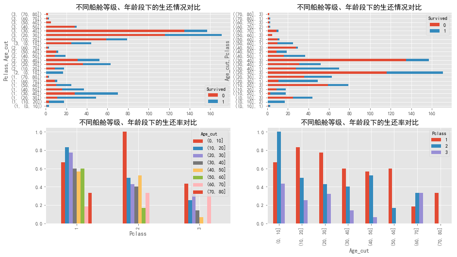


可以看到，除了特殊年龄段0-10，其他年龄段上，船舱等级越高乘客生还率普遍越高  
而同一船舱，除了特殊年龄段0-10，其他年龄段乘客的生还率相当   
三等舱20-40年龄段的乘客未生还人数最多  
**因此认为：特殊年龄段0-10以外，乘客船舱等级对生还率的影响明显大于乘客的年龄段**


```python
#探究票价区间与年龄段对生还率的影响
two_plot('Age_cut','Fare_cut','年龄段','票价区间')
```


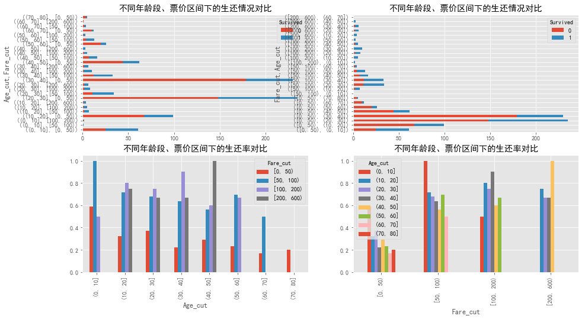


```python
#图示分组太多，不够清晰，换用散点图
fig,ax=plt.subplots()
ti[ti.Survived==1].plot.scatter('Age','Fare',ax=ax,c='g',grid=True,label='生还')
ti[ti.Survived==0].plot.scatter('Age','Fare',ax=ax,c='r',grid=True,label='未生还')
ax.set_ylim(0,300)
```


    (0, 300)


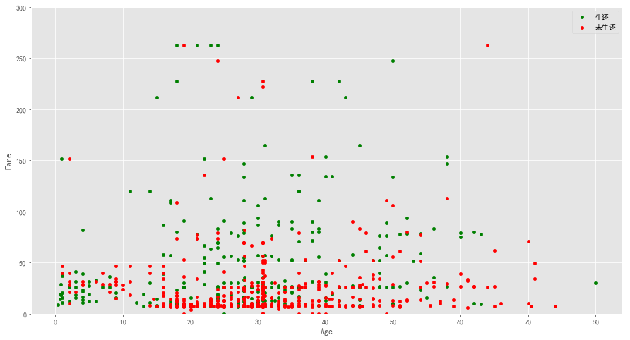


可以看出，生还乘客上，除了年龄段在0-10的生还乘客有集中现象，其余生还乘客分布较为分散  
而未生还乘客明显集中在票价低的乘客上，靠近于图示底部集中  
**因此认为：特殊年龄段0-10以外，票价区间对生还率的影响明显大于乘客的年龄段  
因为票价区间直接关联到船舱等级，侧面体现了船舱等级的影响**

# 四. 结论和改进建议

## 1. 结论

Titanic号上乘客的生还率影响因素有：**性别，船舱等级，年龄，同行亲友数，票价**
> 其中：  
* 性别优先级最高，影响程度最大，女性的生还率远高于男性
* 船舱等级影响程度次之，船舱等级越高，生还率越高
* 0-10年龄段的乘客生还率高，其余年龄段相当，表现不明显
* 同行亲友数对乘客生还率也有影响，同行亲友数为1或2个的乘客，生还率要明显高于独自出行的乘客

> 可以结合实际情况解释：根据相关报导，Titanic失事后，船长等人指示妇女和小孩先走，而乘客也很好地遵守

## 2. 改进建议

> * 因年龄缺失值较多，所用均值填充的办法会使年龄集中于均值，影响后续的分析准确度，可考虑其他填充方式
> * 对Name，Ticket，Cabin等字段，直接分析较难，但可结合相关历史资料，进行辅助分析 
> * 所用数据集仅为训练集，只占总乘客数的1/3，叠加上测试集能使结果更为准确
> * 可考虑使用机器学习的相关算法做预测，进一步佐证描述性分析
