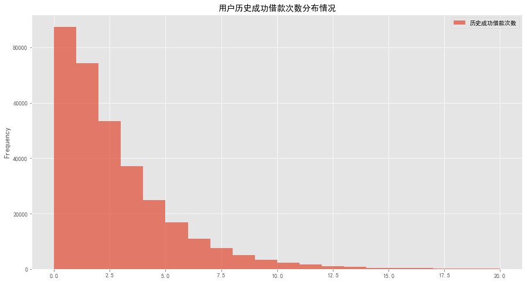

# 拍拍贷用户违约情况分析
***

* **分析目的**：通过分析拍拍贷用户借款的相关数据，提取出违约用户的相关特征，找出哪类用户更可能违约，  
&emsp;&emsp;&emsp;&emsp;&emsp;从而初步描绘出更可能违约的用户画像  
* **分析思路**：先对借款用户总体信息进行考察，了解不同特征用户分布情况，再分析不同特征用户的违约情况，  
&emsp;&emsp;&emsp;&emsp;&emsp;最后整合出更可能违约的用户相关特征  

> 数据来源于网络，拍拍贷2015-2017的相关业务数据，已脱敏  
所用到的数据有两部分：LC(Loan Characteristics)即标的特征表、LP(Loan Periodic)即标的还款计划和还款记录表
***


```python
#导入数据分析库包
import numpy as np
import pandas as pd
import matplotlib.pyplot as plt
import seaborn as sns
import warnings 
warnings.filterwarnings('ignore')
```


```python
#预设画布显示
% matplotlib inline
plt.rcParams['figure.figsize'] = (15, 8)
plt.rcParams['font.sans-serif'] =['SimHei']
plt.style.use('ggplot')
```

# 一.  数据预览

## 1.1  LC(Loan Characteristics)


```python
#导入LC数据集
LC=pd.read_csv('F:/LC.csv')
```


```python
LC.head()
```


<div>
<table border="1" class="dataframe">
  <thead>
    <tr style="text-align: right;">
      <th></th>
      <th>ListingId</th>
      <th>借款金额</th>
      <th>借款期限</th>
      <th>借款利率</th>
      <th>借款成功日期</th>
      <th>初始评级</th>
      <th>借款类型</th>
      <th>是否首标</th>
      <th>年龄</th>
      <th>性别</th>
      <th>...</th>
      <th>户口认证</th>
      <th>视频认证</th>
      <th>学历认证</th>
      <th>征信认证</th>
      <th>淘宝认证</th>
      <th>历史成功借款次数</th>
      <th>历史成功借款金额</th>
      <th>总待还本金</th>
      <th>历史正常还款期数</th>
      <th>历史逾期还款期数</th>
    </tr>
  </thead>
  <tbody>
    <tr>
      <th>0</th>
      <td>126541</td>
      <td>18000</td>
      <td>12</td>
      <td>18.0</td>
      <td>2015-05-04</td>
      <td>C</td>
      <td>其他</td>
      <td>否</td>
      <td>35</td>
      <td>男</td>
      <td>...</td>
      <td>未成功认证</td>
      <td>成功认证</td>
      <td>未成功认证</td>
      <td>未成功认证</td>
      <td>未成功认证</td>
      <td>11</td>
      <td>40326.0</td>
      <td>8712.73</td>
      <td>57</td>
      <td>16</td>
    </tr>
    <tr>
      <th>1</th>
      <td>133291</td>
      <td>9453</td>
      <td>12</td>
      <td>20.0</td>
      <td>2015-03-16</td>
      <td>D</td>
      <td>其他</td>
      <td>否</td>
      <td>34</td>
      <td>男</td>
      <td>...</td>
      <td>成功认证</td>
      <td>未成功认证</td>
      <td>未成功认证</td>
      <td>未成功认证</td>
      <td>未成功认证</td>
      <td>4</td>
      <td>14500.0</td>
      <td>7890.64</td>
      <td>13</td>
      <td>1</td>
    </tr>
    <tr>
      <th>2</th>
      <td>142421</td>
      <td>27000</td>
      <td>24</td>
      <td>20.0</td>
      <td>2016-04-26</td>
      <td>E</td>
      <td>普通</td>
      <td>否</td>
      <td>41</td>
      <td>男</td>
      <td>...</td>
      <td>未成功认证</td>
      <td>未成功认证</td>
      <td>未成功认证</td>
      <td>未成功认证</td>
      <td>未成功认证</td>
      <td>5</td>
      <td>21894.0</td>
      <td>11726.32</td>
      <td>25</td>
      <td>3</td>
    </tr>
    <tr>
      <th>3</th>
      <td>149711</td>
      <td>25000</td>
      <td>12</td>
      <td>18.0</td>
      <td>2015-03-30</td>
      <td>C</td>
      <td>其他</td>
      <td>否</td>
      <td>34</td>
      <td>男</td>
      <td>...</td>
      <td>成功认证</td>
      <td>成功认证</td>
      <td>未成功认证</td>
      <td>未成功认证</td>
      <td>未成功认证</td>
      <td>6</td>
      <td>36190.0</td>
      <td>9703.41</td>
      <td>41</td>
      <td>1</td>
    </tr>
    <tr>
      <th>4</th>
      <td>152141</td>
      <td>20000</td>
      <td>6</td>
      <td>16.0</td>
      <td>2015-01-22</td>
      <td>C</td>
      <td>电商</td>
      <td>否</td>
      <td>24</td>
      <td>男</td>
      <td>...</td>
      <td>成功认证</td>
      <td>成功认证</td>
      <td>未成功认证</td>
      <td>未成功认证</td>
      <td>未成功认证</td>
      <td>13</td>
      <td>77945.0</td>
      <td>0.00</td>
      <td>118</td>
      <td>14</td>
    </tr>
  </tbody>
</table>
<p>5 rows × 21 columns</p>
</div>


```python
#修改ListingId为单号，更整齐
LC.rename(columns={'ListingId':'单号'},inplace=True)
```


```python
LC.info()
```

    <class 'pandas.core.frame.DataFrame'>
    RangeIndex: 328553 entries, 0 to 328552
    Data columns (total 21 columns):
    单号          328553 non-null int64
    借款金额        328553 non-null int64
    借款期限        328553 non-null int64
    借款利率        328553 non-null float64
    借款成功日期      328553 non-null object
    初始评级        328553 non-null object
    借款类型        328553 non-null object
    是否首标        328553 non-null object
    年龄          328553 non-null int64
    性别          328553 non-null object
    手机认证        328553 non-null object
    户口认证        328553 non-null object
    视频认证        328553 non-null object
    学历认证        328553 non-null object
    征信认证        328553 non-null object
    淘宝认证        328553 non-null object
    历史成功借款次数    328553 non-null int64
    历史成功借款金额    328553 non-null float64
    总待还本金       328553 non-null float64
    历史正常还款期数    328553 non-null int64
    历史逾期还款期数    328553 non-null int64
    dtypes: float64(3), int64(7), object(11)
    memory usage: 52.6+ MB
    

数据有328553条，21个字段，无缺失值  
字段字典如下：  
> 单号：列表的序号，即标的序号  
借款金额：列表成交总金额  
借款期限：总的期数（按月计）  
借款利率：年化利率（百分数）  
借款成功日期：列表成交的日期，都在2015年1月1日以后  
初始评级：列表成交时的信用评级，AAA为安全标，AA为赔标，A-F为信用等级  
借款类型：分为'应收安全标'，‘电商’，‘APP闪电’，‘普通’和‘其他’  
是否首标：该标是否为借款人首标  
年龄：借款人在该列表借款成功时的年龄  
性别：该列表借款人性别  
手机认证：该列表借款人手机实名认证是否成功  
户口认证：该列表借款人户口认证是否成功  
视频认证：该列表借款人视频认证是否成功  
学历认证：该列表借款人学历认证是否成功，成功则表示有大专及以上学历  
征信认证：该列表借款人征信认证是否成功，成功则表示有人行征信报告  
淘宝认证：该列表借款人淘宝认证是否成功，成功则表示为淘宝店主  
历史成功借款次数：借款人在该列表成交之前的借款成功次数  
历史成功借款金额：借款人在该列表成交之前的借款成功金额  
总待还本金：借款人在该列表成交之前待还本金金额  
历史正常还款期数：借款人在该列表成交之前的按期还款期数  
历史逾期还款期数：借款人在该列表成交之前的逾期还款期数  


```python
LC.describe()
```


<div>
<table border="1" class="dataframe">
  <thead>
    <tr style="text-align: right;">
      <th></th>
      <th>单号</th>
      <th>借款金额</th>
      <th>借款期限</th>
      <th>借款利率</th>
      <th>年龄</th>
      <th>历史成功借款次数</th>
      <th>历史成功借款金额</th>
      <th>总待还本金</th>
      <th>历史正常还款期数</th>
      <th>历史逾期还款期数</th>
    </tr>
  </thead>
  <tbody>
    <tr>
      <th>count</th>
      <td>3.285530e+05</td>
      <td>328553.000000</td>
      <td>328553.000000</td>
      <td>328553.000000</td>
      <td>328553.000000</td>
      <td>328553.000000</td>
      <td>3.285530e+05</td>
      <td>3.285530e+05</td>
      <td>328553.000000</td>
      <td>328553.000000</td>
    </tr>
    <tr>
      <th>mean</th>
      <td>1.907948e+07</td>
      <td>4423.816906</td>
      <td>10.213594</td>
      <td>20.601439</td>
      <td>29.143042</td>
      <td>2.323159</td>
      <td>8.785857e+03</td>
      <td>3.721665e+03</td>
      <td>9.947658</td>
      <td>0.423250</td>
    </tr>
    <tr>
      <th>std</th>
      <td>8.375769e+06</td>
      <td>11219.664024</td>
      <td>2.780444</td>
      <td>1.772408</td>
      <td>6.624286</td>
      <td>2.922361</td>
      <td>3.502736e+04</td>
      <td>8.626061e+03</td>
      <td>14.839899</td>
      <td>1.595681</td>
    </tr>
    <tr>
      <th>min</th>
      <td>1.265410e+05</td>
      <td>100.000000</td>
      <td>1.000000</td>
      <td>6.500000</td>
      <td>17.000000</td>
      <td>0.000000</td>
      <td>0.000000e+00</td>
      <td>0.000000e+00</td>
      <td>0.000000</td>
      <td>0.000000</td>
    </tr>
    <tr>
      <th>25%</th>
      <td>1.190887e+07</td>
      <td>2033.000000</td>
      <td>6.000000</td>
      <td>20.000000</td>
      <td>24.000000</td>
      <td>0.000000</td>
      <td>0.000000e+00</td>
      <td>0.000000e+00</td>
      <td>0.000000</td>
      <td>0.000000</td>
    </tr>
    <tr>
      <th>50%</th>
      <td>1.952325e+07</td>
      <td>3397.000000</td>
      <td>12.000000</td>
      <td>20.000000</td>
      <td>28.000000</td>
      <td>2.000000</td>
      <td>5.000000e+03</td>
      <td>2.542410e+03</td>
      <td>5.000000</td>
      <td>0.000000</td>
    </tr>
    <tr>
      <th>75%</th>
      <td>2.629862e+07</td>
      <td>5230.000000</td>
      <td>12.000000</td>
      <td>22.000000</td>
      <td>33.000000</td>
      <td>3.000000</td>
      <td>1.035500e+04</td>
      <td>5.446810e+03</td>
      <td>13.000000</td>
      <td>0.000000</td>
    </tr>
    <tr>
      <th>max</th>
      <td>3.281953e+07</td>
      <td>500000.000000</td>
      <td>24.000000</td>
      <td>24.000000</td>
      <td>56.000000</td>
      <td>649.000000</td>
      <td>7.405926e+06</td>
      <td>1.172653e+06</td>
      <td>2507.000000</td>
      <td>60.000000</td>
    </tr>
  </tbody>
</table>
</div>


可以看到：  
* 借款平均金额有4423，最小借款100，最大借款500000,1/4分位和中位值为2033和3397，可见借款以小额贷款为主  
* 借款期限平均10.2期，最小1期，最大24期，中位和3/4分位值都为12，即分期12期最为普遍  
* 借款年利率均值20.6%，最少6.5%，最大24%，各分位值利率相当，可见利率总体比较一致  
* 借款用户平均年龄29岁，最小17岁，最大56岁，可见年龄分位值在20-35间的借款人数最多  
* 历史成功借款次数均值2.3次，最大649次，中位数2，可见多数用户借款频次不高，不超过3次  
* 历史借款金额平均约8786，结合历史平均借款约2次，即历史单次借款金额约4300，与当前借款金额平均值相当，比较稳定  
* 历史平均正常还款期数和逾期还款期数分别为14.8期和1.59期，比例约7:1

## 1.2  LP(Loan Periodic)


```python
#导入LP数据集
LP=pd.read_csv('F:/LP.csv')
```


```python
LP.head()
```


<div>
<table border="1" class="dataframe">
  <thead>
    <tr style="text-align: right;">
      <th></th>
      <th>ListingId</th>
      <th>期数</th>
      <th>还款状态</th>
      <th>应还本金</th>
      <th>应还利息</th>
      <th>剩余本金</th>
      <th>剩余利息</th>
      <th>到期日期</th>
      <th>还款日期</th>
      <th>recorddate</th>
    </tr>
  </thead>
  <tbody>
    <tr>
      <th>0</th>
      <td>126541</td>
      <td>1</td>
      <td>1</td>
      <td>1380.23</td>
      <td>270.00</td>
      <td>0.0</td>
      <td>0.0</td>
      <td>2015-06-04</td>
      <td>2015-06-04</td>
      <td>2017-02-22</td>
    </tr>
    <tr>
      <th>1</th>
      <td>126541</td>
      <td>2</td>
      <td>1</td>
      <td>1400.94</td>
      <td>249.29</td>
      <td>0.0</td>
      <td>0.0</td>
      <td>2015-07-04</td>
      <td>2015-07-04</td>
      <td>2017-02-22</td>
    </tr>
    <tr>
      <th>2</th>
      <td>126541</td>
      <td>3</td>
      <td>1</td>
      <td>1421.95</td>
      <td>228.28</td>
      <td>0.0</td>
      <td>0.0</td>
      <td>2015-08-04</td>
      <td>2015-08-04</td>
      <td>2017-02-22</td>
    </tr>
    <tr>
      <th>3</th>
      <td>126541</td>
      <td>4</td>
      <td>1</td>
      <td>1443.28</td>
      <td>206.95</td>
      <td>0.0</td>
      <td>0.0</td>
      <td>2015-09-04</td>
      <td>2015-09-04</td>
      <td>2017-02-22</td>
    </tr>
    <tr>
      <th>4</th>
      <td>126541</td>
      <td>5</td>
      <td>1</td>
      <td>1464.93</td>
      <td>185.30</td>
      <td>0.0</td>
      <td>0.0</td>
      <td>2015-10-04</td>
      <td>2015-10-04</td>
      <td>2017-02-22</td>
    </tr>
  </tbody>
</table>
</div>


```python
#同样地，修改列名使之一致
LP.rename(columns={'ListingId':'单号','recorddate':'记录日期'},inplace=True)
```


```python
LP.info()
```

    <class 'pandas.core.frame.DataFrame'>
    RangeIndex: 3203276 entries, 0 to 3203275
    Data columns (total 10 columns):
    单号      int64
    期数      int64
    还款状态    int64
    应还本金    float64
    应还利息    float64
    剩余本金    float64
    剩余利息    float64
    到期日期    object
    还款日期    object
    记录日期    object
    dtypes: float64(4), int64(3), object(3)
    memory usage: 244.4+ MB
    

数据有3203276条，有10个字段  
字段字典如下：  
> 单号：列表的序号，即标的序号  
期数：该期还款的期数号  
还款状态：到记录日的当期状态，分为0-‘未还款’，1-‘已正常还款’，2-‘已逾期还款’，3-‘已提前还清该标全部欠款’，4-‘已部分还款’  
应还本金：当期计划还款本金部分  
应还利息：当期计划还款利息部分  
剩余本金：到记录日，仍未还清的当期本金  
剩余利息：到记录日，仍未还清的当期利息  
到期日期：当期应还款日  
还款日期：当期最近一次实际还款日期  
记录日期：记录列表的日期  


```python
LP.describe()
```


<div>
<table border="1" class="dataframe">
  <thead>
    <tr style="text-align: right;">
      <th></th>
      <th>单号</th>
      <th>期数</th>
      <th>还款状态</th>
      <th>应还本金</th>
      <th>应还利息</th>
      <th>剩余本金</th>
      <th>剩余利息</th>
    </tr>
  </thead>
  <tbody>
    <tr>
      <th>count</th>
      <td>3.203276e+06</td>
      <td>3.203276e+06</td>
      <td>3.203276e+06</td>
      <td>3.203276e+06</td>
      <td>3.203276e+06</td>
      <td>3.203276e+06</td>
      <td>3.203276e+06</td>
    </tr>
    <tr>
      <th>mean</th>
      <td>1.947391e+07</td>
      <td>5.904377e+00</td>
      <td>6.037828e-01</td>
      <td>4.604506e+02</td>
      <td>4.232540e+01</td>
      <td>1.846682e+02</td>
      <td>1.472581e+01</td>
    </tr>
    <tr>
      <th>std</th>
      <td>8.312219e+06</td>
      <td>3.455267e+00</td>
      <td>6.684636e-01</td>
      <td>2.041906e+03</td>
      <td>8.346626e+01</td>
      <td>4.012435e+02</td>
      <td>2.999337e+01</td>
    </tr>
    <tr>
      <th>min</th>
      <td>1.265410e+05</td>
      <td>1.000000e+00</td>
      <td>0.000000e+00</td>
      <td>0.000000e+00</td>
      <td>0.000000e+00</td>
      <td>0.000000e+00</td>
      <td>0.000000e+00</td>
    </tr>
    <tr>
      <th>25%</th>
      <td>1.222287e+07</td>
      <td>3.000000e+00</td>
      <td>0.000000e+00</td>
      <td>1.881500e+02</td>
      <td>1.301000e+01</td>
      <td>0.000000e+00</td>
      <td>0.000000e+00</td>
    </tr>
    <tr>
      <th>50%</th>
      <td>2.025666e+07</td>
      <td>6.000000e+00</td>
      <td>1.000000e+00</td>
      <td>3.309400e+02</td>
      <td>2.978000e+01</td>
      <td>0.000000e+00</td>
      <td>0.000000e+00</td>
    </tr>
    <tr>
      <th>75%</th>
      <td>2.661693e+07</td>
      <td>9.000000e+00</td>
      <td>1.000000e+00</td>
      <td>5.123400e+02</td>
      <td>5.539000e+01</td>
      <td>2.991400e+02</td>
      <td>1.968000e+01</td>
    </tr>
    <tr>
      <th>max</th>
      <td>3.281953e+07</td>
      <td>2.400000e+01</td>
      <td>4.000000e+00</td>
      <td>5.000000e+05</td>
      <td>1.875000e+04</td>
      <td>1.000000e+05</td>
      <td>3.978370e+03</td>
    </tr>
  </tbody>
</table>
</div>


可以看到：  
* 由于此处期数为还款的期数号，故而约为还款总期数的1/2，均值5.9期与前符合  
* 还款状态0.6，略远离0，由于还款状态为0的包括已到期不还款和尚未到期的，需后续讨论  
* 应还本金均值4600，与前借款金额比较一致  

# 二.  数据预处理

## 2.1  LC表预处理


```python
#查看单号是否唯一
LC['单号'].unique().shape
```


    (328553,)


```python
#借款成功日期格式转为时间类型
LC['借款成功日期']=pd.to_datetime(LC['借款成功日期'])
```


```python
#统一各认证项，添加‘认证成功项目数’进行评估
qualify={'成功认证':1,'未成功认证':0}
LC=LC.assign(A=lambda x:x[['手机认证','户口认证','视频认证','学历认证','征信认证','淘宝认证']].applymap(lambda x:qualify[x]).apply(np.sum,axis=1))
LC.rename(columns={'A':'认证成功项目数'},inplace=True)
LC.head()
```


<div>
<table border="1" class="dataframe">
  <thead>
    <tr style="text-align: right;">
      <th></th>
      <th>单号</th>
      <th>借款金额</th>
      <th>借款期限</th>
      <th>借款利率</th>
      <th>借款成功日期</th>
      <th>初始评级</th>
      <th>借款类型</th>
      <th>是否首标</th>
      <th>年龄</th>
      <th>性别</th>
      <th>...</th>
      <th>视频认证</th>
      <th>学历认证</th>
      <th>征信认证</th>
      <th>淘宝认证</th>
      <th>历史成功借款次数</th>
      <th>历史成功借款金额</th>
      <th>总待还本金</th>
      <th>历史正常还款期数</th>
      <th>历史逾期还款期数</th>
      <th>认证成功项目数</th>
    </tr>
  </thead>
  <tbody>
    <tr>
      <th>0</th>
      <td>126541</td>
      <td>18000</td>
      <td>12</td>
      <td>18.0</td>
      <td>2015-05-04</td>
      <td>C</td>
      <td>其他</td>
      <td>否</td>
      <td>35</td>
      <td>男</td>
      <td>...</td>
      <td>成功认证</td>
      <td>未成功认证</td>
      <td>未成功认证</td>
      <td>未成功认证</td>
      <td>11</td>
      <td>40326.0</td>
      <td>8712.73</td>
      <td>57</td>
      <td>16</td>
      <td>2</td>
    </tr>
    <tr>
      <th>1</th>
      <td>133291</td>
      <td>9453</td>
      <td>12</td>
      <td>20.0</td>
      <td>2015-03-16</td>
      <td>D</td>
      <td>其他</td>
      <td>否</td>
      <td>34</td>
      <td>男</td>
      <td>...</td>
      <td>未成功认证</td>
      <td>未成功认证</td>
      <td>未成功认证</td>
      <td>未成功认证</td>
      <td>4</td>
      <td>14500.0</td>
      <td>7890.64</td>
      <td>13</td>
      <td>1</td>
      <td>1</td>
    </tr>
    <tr>
      <th>2</th>
      <td>142421</td>
      <td>27000</td>
      <td>24</td>
      <td>20.0</td>
      <td>2016-04-26</td>
      <td>E</td>
      <td>普通</td>
      <td>否</td>
      <td>41</td>
      <td>男</td>
      <td>...</td>
      <td>未成功认证</td>
      <td>未成功认证</td>
      <td>未成功认证</td>
      <td>未成功认证</td>
      <td>5</td>
      <td>21894.0</td>
      <td>11726.32</td>
      <td>25</td>
      <td>3</td>
      <td>1</td>
    </tr>
    <tr>
      <th>3</th>
      <td>149711</td>
      <td>25000</td>
      <td>12</td>
      <td>18.0</td>
      <td>2015-03-30</td>
      <td>C</td>
      <td>其他</td>
      <td>否</td>
      <td>34</td>
      <td>男</td>
      <td>...</td>
      <td>成功认证</td>
      <td>未成功认证</td>
      <td>未成功认证</td>
      <td>未成功认证</td>
      <td>6</td>
      <td>36190.0</td>
      <td>9703.41</td>
      <td>41</td>
      <td>1</td>
      <td>3</td>
    </tr>
    <tr>
      <th>4</th>
      <td>152141</td>
      <td>20000</td>
      <td>6</td>
      <td>16.0</td>
      <td>2015-01-22</td>
      <td>C</td>
      <td>电商</td>
      <td>否</td>
      <td>24</td>
      <td>男</td>
      <td>...</td>
      <td>成功认证</td>
      <td>未成功认证</td>
      <td>未成功认证</td>
      <td>未成功认证</td>
      <td>13</td>
      <td>77945.0</td>
      <td>0.00</td>
      <td>118</td>
      <td>14</td>
      <td>3</td>
    </tr>
  </tbody>
</table>
<p>5 rows × 22 columns</p>
</div>


## 2.2 LP表预处理


```python
#查看不重复单号数是否与LC表相对应
LP['单号'].unique().shape
```


    (328553,)


```python
#查看是否有缺失值
LP.isnull().sum()
```


    单号      0
    期数      0
    还款状态    0
    应还本金    0
    应还利息    0
    剩余本金    0
    剩余利息    0
    到期日期    0
    还款日期    0
    记录日期    0
    dtype: int64


```python
#日期字段转为时间类型
LP['到期日期']=pd.to_datetime(LP['到期日期'])
#此列格式或有问题，指定不报错
LP['还款日期']=pd.to_datetime(LP['还款日期'],errors='coerce')
LP['记录日期']=pd.to_datetime(LP['记录日期'])
```


```python
#考察还款方式
LP['应还本息和']=LP['应还本金']+LP['应还利息']
LP.head(30)
```


<div>
<table border="1" class="dataframe">
  <thead>
    <tr style="text-align: right;">
      <th></th>
      <th>单号</th>
      <th>期数</th>
      <th>还款状态</th>
      <th>应还本金</th>
      <th>应还利息</th>
      <th>剩余本金</th>
      <th>剩余利息</th>
      <th>到期日期</th>
      <th>还款日期</th>
      <th>记录日期</th>
      <th>应还本息和</th>
    </tr>
  </thead>
  <tbody>
    <tr>
      <th>0</th>
      <td>126541</td>
      <td>1</td>
      <td>1</td>
      <td>1380.23</td>
      <td>270.00</td>
      <td>0.0</td>
      <td>0.0</td>
      <td>2015-06-04</td>
      <td>2015-06-04</td>
      <td>2017-02-22</td>
      <td>1650.23</td>
    </tr>
    <tr>
      <th>1</th>
      <td>126541</td>
      <td>2</td>
      <td>1</td>
      <td>1400.94</td>
      <td>249.29</td>
      <td>0.0</td>
      <td>0.0</td>
      <td>2015-07-04</td>
      <td>2015-07-04</td>
      <td>2017-02-22</td>
      <td>1650.23</td>
    </tr>
    <tr>
      <th>2</th>
      <td>126541</td>
      <td>3</td>
      <td>1</td>
      <td>1421.95</td>
      <td>228.28</td>
      <td>0.0</td>
      <td>0.0</td>
      <td>2015-08-04</td>
      <td>2015-08-04</td>
      <td>2017-02-22</td>
      <td>1650.23</td>
    </tr>
    <tr>
      <th>3</th>
      <td>126541</td>
      <td>4</td>
      <td>1</td>
      <td>1443.28</td>
      <td>206.95</td>
      <td>0.0</td>
      <td>0.0</td>
      <td>2015-09-04</td>
      <td>2015-09-04</td>
      <td>2017-02-22</td>
      <td>1650.23</td>
    </tr>
    <tr>
      <th>4</th>
      <td>126541</td>
      <td>5</td>
      <td>1</td>
      <td>1464.93</td>
      <td>185.30</td>
      <td>0.0</td>
      <td>0.0</td>
      <td>2015-10-04</td>
      <td>2015-10-04</td>
      <td>2017-02-22</td>
      <td>1650.23</td>
    </tr>
    <tr>
      <th>5</th>
      <td>126541</td>
      <td>6</td>
      <td>1</td>
      <td>1486.90</td>
      <td>163.33</td>
      <td>0.0</td>
      <td>0.0</td>
      <td>2015-11-04</td>
      <td>2015-11-04</td>
      <td>2017-02-22</td>
      <td>1650.23</td>
    </tr>
    <tr>
      <th>6</th>
      <td>126541</td>
      <td>7</td>
      <td>2</td>
      <td>1509.21</td>
      <td>141.02</td>
      <td>0.0</td>
      <td>0.0</td>
      <td>2015-12-04</td>
      <td>2015-12-05</td>
      <td>2017-02-22</td>
      <td>1650.23</td>
    </tr>
    <tr>
      <th>7</th>
      <td>126541</td>
      <td>8</td>
      <td>1</td>
      <td>1531.85</td>
      <td>118.38</td>
      <td>0.0</td>
      <td>0.0</td>
      <td>2016-01-04</td>
      <td>2016-01-04</td>
      <td>2017-02-22</td>
      <td>1650.23</td>
    </tr>
    <tr>
      <th>8</th>
      <td>126541</td>
      <td>9</td>
      <td>2</td>
      <td>1554.82</td>
      <td>95.41</td>
      <td>0.0</td>
      <td>0.0</td>
      <td>2016-02-04</td>
      <td>2016-02-05</td>
      <td>2017-02-22</td>
      <td>1650.23</td>
    </tr>
    <tr>
      <th>9</th>
      <td>126541</td>
      <td>10</td>
      <td>2</td>
      <td>1578.15</td>
      <td>72.08</td>
      <td>0.0</td>
      <td>0.0</td>
      <td>2016-03-04</td>
      <td>2016-03-06</td>
      <td>2017-02-22</td>
      <td>1650.23</td>
    </tr>
    <tr>
      <th>10</th>
      <td>126541</td>
      <td>11</td>
      <td>2</td>
      <td>1601.82</td>
      <td>48.41</td>
      <td>0.0</td>
      <td>0.0</td>
      <td>2016-04-04</td>
      <td>2016-04-05</td>
      <td>2017-02-22</td>
      <td>1650.23</td>
    </tr>
    <tr>
      <th>11</th>
      <td>126541</td>
      <td>12</td>
      <td>1</td>
      <td>1625.92</td>
      <td>24.31</td>
      <td>0.0</td>
      <td>0.0</td>
      <td>2016-05-04</td>
      <td>2016-05-04</td>
      <td>2017-02-22</td>
      <td>1650.23</td>
    </tr>
    <tr>
      <th>12</th>
      <td>133291</td>
      <td>1</td>
      <td>1</td>
      <td>718.12</td>
      <td>157.55</td>
      <td>0.0</td>
      <td>0.0</td>
      <td>2015-04-16</td>
      <td>2015-03-17</td>
      <td>2017-02-22</td>
      <td>875.67</td>
    </tr>
    <tr>
      <th>13</th>
      <td>133291</td>
      <td>2</td>
      <td>1</td>
      <td>730.09</td>
      <td>145.58</td>
      <td>0.0</td>
      <td>0.0</td>
      <td>2015-05-16</td>
      <td>2015-03-17</td>
      <td>2017-02-22</td>
      <td>875.67</td>
    </tr>
    <tr>
      <th>14</th>
      <td>133291</td>
      <td>3</td>
      <td>1</td>
      <td>742.26</td>
      <td>133.41</td>
      <td>0.0</td>
      <td>0.0</td>
      <td>2015-06-16</td>
      <td>2015-03-17</td>
      <td>2017-02-22</td>
      <td>875.67</td>
    </tr>
    <tr>
      <th>15</th>
      <td>133291</td>
      <td>4</td>
      <td>1</td>
      <td>754.63</td>
      <td>121.04</td>
      <td>0.0</td>
      <td>0.0</td>
      <td>2015-07-16</td>
      <td>2015-03-17</td>
      <td>2017-02-22</td>
      <td>875.67</td>
    </tr>
    <tr>
      <th>16</th>
      <td>133291</td>
      <td>5</td>
      <td>1</td>
      <td>767.21</td>
      <td>108.46</td>
      <td>0.0</td>
      <td>0.0</td>
      <td>2015-08-16</td>
      <td>2015-03-17</td>
      <td>2017-02-22</td>
      <td>875.67</td>
    </tr>
    <tr>
      <th>17</th>
      <td>133291</td>
      <td>6</td>
      <td>1</td>
      <td>780.00</td>
      <td>95.67</td>
      <td>0.0</td>
      <td>0.0</td>
      <td>2015-09-16</td>
      <td>2015-03-17</td>
      <td>2017-02-22</td>
      <td>875.67</td>
    </tr>
    <tr>
      <th>18</th>
      <td>133291</td>
      <td>7</td>
      <td>2</td>
      <td>793.00</td>
      <td>82.67</td>
      <td>0.0</td>
      <td>0.0</td>
      <td>2015-10-16</td>
      <td>2015-10-20</td>
      <td>2017-02-22</td>
      <td>875.67</td>
    </tr>
    <tr>
      <th>19</th>
      <td>133291</td>
      <td>8</td>
      <td>1</td>
      <td>806.21</td>
      <td>69.46</td>
      <td>0.0</td>
      <td>0.0</td>
      <td>2015-11-16</td>
      <td>2015-11-16</td>
      <td>2017-02-22</td>
      <td>875.67</td>
    </tr>
    <tr>
      <th>20</th>
      <td>133291</td>
      <td>9</td>
      <td>2</td>
      <td>819.65</td>
      <td>56.02</td>
      <td>0.0</td>
      <td>0.0</td>
      <td>2015-12-16</td>
      <td>2015-12-24</td>
      <td>2017-02-22</td>
      <td>875.67</td>
    </tr>
    <tr>
      <th>21</th>
      <td>133291</td>
      <td>10</td>
      <td>1</td>
      <td>833.31</td>
      <td>42.36</td>
      <td>0.0</td>
      <td>0.0</td>
      <td>2016-01-16</td>
      <td>2016-01-15</td>
      <td>2017-02-22</td>
      <td>875.67</td>
    </tr>
    <tr>
      <th>22</th>
      <td>133291</td>
      <td>11</td>
      <td>1</td>
      <td>847.20</td>
      <td>28.47</td>
      <td>0.0</td>
      <td>0.0</td>
      <td>2016-02-16</td>
      <td>2016-02-16</td>
      <td>2017-02-22</td>
      <td>875.67</td>
    </tr>
    <tr>
      <th>23</th>
      <td>133291</td>
      <td>12</td>
      <td>2</td>
      <td>861.32</td>
      <td>14.35</td>
      <td>0.0</td>
      <td>0.0</td>
      <td>2016-03-16</td>
      <td>2016-03-18</td>
      <td>2017-02-22</td>
      <td>875.67</td>
    </tr>
    <tr>
      <th>24</th>
      <td>142421</td>
      <td>1</td>
      <td>1</td>
      <td>924.18</td>
      <td>450.00</td>
      <td>0.0</td>
      <td>0.0</td>
      <td>2016-05-26</td>
      <td>2016-05-26</td>
      <td>2017-02-22</td>
      <td>1374.18</td>
    </tr>
    <tr>
      <th>25</th>
      <td>142421</td>
      <td>2</td>
      <td>1</td>
      <td>939.59</td>
      <td>434.59</td>
      <td>0.0</td>
      <td>0.0</td>
      <td>2016-06-26</td>
      <td>2016-06-26</td>
      <td>2017-02-22</td>
      <td>1374.18</td>
    </tr>
    <tr>
      <th>26</th>
      <td>142421</td>
      <td>3</td>
      <td>1</td>
      <td>955.25</td>
      <td>418.93</td>
      <td>0.0</td>
      <td>0.0</td>
      <td>2016-07-26</td>
      <td>2016-07-25</td>
      <td>2017-02-22</td>
      <td>1374.18</td>
    </tr>
    <tr>
      <th>27</th>
      <td>142421</td>
      <td>4</td>
      <td>1</td>
      <td>971.17</td>
      <td>403.01</td>
      <td>0.0</td>
      <td>0.0</td>
      <td>2016-08-26</td>
      <td>2016-08-24</td>
      <td>2017-02-22</td>
      <td>1374.18</td>
    </tr>
    <tr>
      <th>28</th>
      <td>142421</td>
      <td>5</td>
      <td>1</td>
      <td>987.35</td>
      <td>386.83</td>
      <td>0.0</td>
      <td>0.0</td>
      <td>2016-09-26</td>
      <td>2016-09-25</td>
      <td>2017-02-22</td>
      <td>1374.18</td>
    </tr>
    <tr>
      <th>29</th>
      <td>142421</td>
      <td>6</td>
      <td>1</td>
      <td>1003.81</td>
      <td>370.37</td>
      <td>0.0</td>
      <td>0.0</td>
      <td>2016-10-26</td>
      <td>2016-10-25</td>
      <td>2017-02-22</td>
      <td>1374.18</td>
    </tr>
  </tbody>
</table>
</div>


观察数据，分期所用还款方式应是等额本息法


```python
#考察是否规范
payment_method=LP.groupby('单号')['应还本息和'].var()
payment_method.head(10) 
```


    单号
    126541    0.000000e+00
    133291    7.049835e-27
    142421    1.524326e+07
    149711    8.905301e+01
    152141    0.000000e+00
    162641    2.824518e+05
    171191    5.169879e-27
    175451    1.879956e-26
    182261    4.348154e+05
    193831    3.101927e-26
    Name: 应还本息和, dtype: float64


若是等额本息法按月还款，除了首末月还款金额有所不同外，其余月份应该相同  
首末月与其他月份差别不大时，方差值应不大于10  
考察表中不符合的项


```python
LP[LP['单号']==142421]
```


<div>
<table border="1" class="dataframe">
  <thead>
    <tr style="text-align: right;">
      <th></th>
      <th>单号</th>
      <th>期数</th>
      <th>还款状态</th>
      <th>应还本金</th>
      <th>应还利息</th>
      <th>剩余本金</th>
      <th>剩余利息</th>
      <th>到期日期</th>
      <th>还款日期</th>
      <th>记录日期</th>
      <th>应还本息和</th>
    </tr>
  </thead>
  <tbody>
    <tr>
      <th>24</th>
      <td>142421</td>
      <td>1</td>
      <td>1</td>
      <td>924.18</td>
      <td>450.00</td>
      <td>0.00</td>
      <td>0.00</td>
      <td>2016-05-26</td>
      <td>2016-05-26</td>
      <td>2017-02-22</td>
      <td>1374.18</td>
    </tr>
    <tr>
      <th>25</th>
      <td>142421</td>
      <td>2</td>
      <td>1</td>
      <td>939.59</td>
      <td>434.59</td>
      <td>0.00</td>
      <td>0.00</td>
      <td>2016-06-26</td>
      <td>2016-06-26</td>
      <td>2017-02-22</td>
      <td>1374.18</td>
    </tr>
    <tr>
      <th>26</th>
      <td>142421</td>
      <td>3</td>
      <td>1</td>
      <td>955.25</td>
      <td>418.93</td>
      <td>0.00</td>
      <td>0.00</td>
      <td>2016-07-26</td>
      <td>2016-07-25</td>
      <td>2017-02-22</td>
      <td>1374.18</td>
    </tr>
    <tr>
      <th>27</th>
      <td>142421</td>
      <td>4</td>
      <td>1</td>
      <td>971.17</td>
      <td>403.01</td>
      <td>0.00</td>
      <td>0.00</td>
      <td>2016-08-26</td>
      <td>2016-08-24</td>
      <td>2017-02-22</td>
      <td>1374.18</td>
    </tr>
    <tr>
      <th>28</th>
      <td>142421</td>
      <td>5</td>
      <td>1</td>
      <td>987.35</td>
      <td>386.83</td>
      <td>0.00</td>
      <td>0.00</td>
      <td>2016-09-26</td>
      <td>2016-09-25</td>
      <td>2017-02-22</td>
      <td>1374.18</td>
    </tr>
    <tr>
      <th>29</th>
      <td>142421</td>
      <td>6</td>
      <td>1</td>
      <td>1003.81</td>
      <td>370.37</td>
      <td>0.00</td>
      <td>0.00</td>
      <td>2016-10-26</td>
      <td>2016-10-25</td>
      <td>2017-02-22</td>
      <td>1374.18</td>
    </tr>
    <tr>
      <th>30</th>
      <td>142421</td>
      <td>7</td>
      <td>1</td>
      <td>1020.54</td>
      <td>353.64</td>
      <td>0.00</td>
      <td>0.00</td>
      <td>2016-11-26</td>
      <td>2016-11-26</td>
      <td>2017-02-22</td>
      <td>1374.18</td>
    </tr>
    <tr>
      <th>31</th>
      <td>142421</td>
      <td>8</td>
      <td>3</td>
      <td>20198.11</td>
      <td>302.97</td>
      <td>0.00</td>
      <td>0.00</td>
      <td>2016-12-26</td>
      <td>2016-12-23</td>
      <td>2017-02-22</td>
      <td>20501.08</td>
    </tr>
    <tr>
      <th>32</th>
      <td>142421</td>
      <td>9</td>
      <td>0</td>
      <td>1054.84</td>
      <td>319.34</td>
      <td>1054.84</td>
      <td>319.34</td>
      <td>2017-01-26</td>
      <td>NaT</td>
      <td>2017-02-22</td>
      <td>1374.18</td>
    </tr>
    <tr>
      <th>33</th>
      <td>142421</td>
      <td>10</td>
      <td>0</td>
      <td>1072.42</td>
      <td>301.76</td>
      <td>1072.42</td>
      <td>301.76</td>
      <td>2017-02-26</td>
      <td>NaT</td>
      <td>2017-02-22</td>
      <td>1374.18</td>
    </tr>
    <tr>
      <th>34</th>
      <td>142421</td>
      <td>11</td>
      <td>0</td>
      <td>1090.30</td>
      <td>283.88</td>
      <td>1090.30</td>
      <td>283.88</td>
      <td>2017-03-26</td>
      <td>NaT</td>
      <td>2017-02-22</td>
      <td>1374.18</td>
    </tr>
    <tr>
      <th>35</th>
      <td>142421</td>
      <td>12</td>
      <td>0</td>
      <td>1108.47</td>
      <td>265.71</td>
      <td>1108.47</td>
      <td>265.71</td>
      <td>2017-04-26</td>
      <td>NaT</td>
      <td>2017-02-22</td>
      <td>1374.18</td>
    </tr>
    <tr>
      <th>36</th>
      <td>142421</td>
      <td>13</td>
      <td>0</td>
      <td>1126.94</td>
      <td>247.24</td>
      <td>1126.94</td>
      <td>247.24</td>
      <td>2017-05-26</td>
      <td>NaT</td>
      <td>2017-02-22</td>
      <td>1374.18</td>
    </tr>
    <tr>
      <th>37</th>
      <td>142421</td>
      <td>14</td>
      <td>0</td>
      <td>1145.73</td>
      <td>228.45</td>
      <td>1145.73</td>
      <td>228.45</td>
      <td>2017-06-26</td>
      <td>NaT</td>
      <td>2017-02-22</td>
      <td>1374.18</td>
    </tr>
    <tr>
      <th>38</th>
      <td>142421</td>
      <td>15</td>
      <td>0</td>
      <td>1164.82</td>
      <td>209.36</td>
      <td>1164.82</td>
      <td>209.36</td>
      <td>2017-07-26</td>
      <td>NaT</td>
      <td>2017-02-22</td>
      <td>1374.18</td>
    </tr>
    <tr>
      <th>39</th>
      <td>142421</td>
      <td>16</td>
      <td>0</td>
      <td>1184.23</td>
      <td>189.95</td>
      <td>1184.23</td>
      <td>189.95</td>
      <td>2017-08-26</td>
      <td>NaT</td>
      <td>2017-02-22</td>
      <td>1374.18</td>
    </tr>
    <tr>
      <th>40</th>
      <td>142421</td>
      <td>17</td>
      <td>0</td>
      <td>1203.97</td>
      <td>170.21</td>
      <td>1203.97</td>
      <td>170.21</td>
      <td>2017-09-26</td>
      <td>NaT</td>
      <td>2017-02-22</td>
      <td>1374.18</td>
    </tr>
    <tr>
      <th>41</th>
      <td>142421</td>
      <td>18</td>
      <td>0</td>
      <td>1224.04</td>
      <td>150.14</td>
      <td>1224.04</td>
      <td>150.14</td>
      <td>2017-10-26</td>
      <td>NaT</td>
      <td>2017-02-22</td>
      <td>1374.18</td>
    </tr>
    <tr>
      <th>42</th>
      <td>142421</td>
      <td>19</td>
      <td>0</td>
      <td>1244.44</td>
      <td>129.74</td>
      <td>1244.44</td>
      <td>129.74</td>
      <td>2017-11-26</td>
      <td>NaT</td>
      <td>2017-02-22</td>
      <td>1374.18</td>
    </tr>
    <tr>
      <th>43</th>
      <td>142421</td>
      <td>20</td>
      <td>0</td>
      <td>1265.18</td>
      <td>109.00</td>
      <td>1265.18</td>
      <td>109.00</td>
      <td>2017-12-26</td>
      <td>NaT</td>
      <td>2017-02-22</td>
      <td>1374.18</td>
    </tr>
    <tr>
      <th>44</th>
      <td>142421</td>
      <td>21</td>
      <td>0</td>
      <td>1286.27</td>
      <td>87.91</td>
      <td>1286.27</td>
      <td>87.91</td>
      <td>2018-01-26</td>
      <td>NaT</td>
      <td>2017-02-22</td>
      <td>1374.18</td>
    </tr>
    <tr>
      <th>45</th>
      <td>142421</td>
      <td>22</td>
      <td>0</td>
      <td>1307.70</td>
      <td>66.48</td>
      <td>1307.70</td>
      <td>66.48</td>
      <td>2018-02-26</td>
      <td>NaT</td>
      <td>2017-02-22</td>
      <td>1374.18</td>
    </tr>
    <tr>
      <th>46</th>
      <td>142421</td>
      <td>23</td>
      <td>0</td>
      <td>1329.50</td>
      <td>44.68</td>
      <td>1329.50</td>
      <td>44.68</td>
      <td>2018-03-26</td>
      <td>NaT</td>
      <td>2017-02-22</td>
      <td>1374.18</td>
    </tr>
    <tr>
      <th>47</th>
      <td>142421</td>
      <td>24</td>
      <td>0</td>
      <td>1351.71</td>
      <td>22.47</td>
      <td>1351.71</td>
      <td>22.47</td>
      <td>2018-04-26</td>
      <td>NaT</td>
      <td>2017-02-22</td>
      <td>1374.18</td>
    </tr>
  </tbody>
</table>
</div>


该标分24期，可以看到在第8期时已提前还款，后续期数应删除


```python
LP[LP['单号']==162641]
```


<div>
<table border="1" class="dataframe">
  <thead>
    <tr style="text-align: right;">
      <th></th>
      <th>单号</th>
      <th>期数</th>
      <th>还款状态</th>
      <th>应还本金</th>
      <th>应还利息</th>
      <th>剩余本金</th>
      <th>剩余利息</th>
      <th>到期日期</th>
      <th>还款日期</th>
      <th>记录日期</th>
      <th>应还本息和</th>
    </tr>
  </thead>
  <tbody>
    <tr>
      <th>66</th>
      <td>162641</td>
      <td>1</td>
      <td>1</td>
      <td>1562.41</td>
      <td>233.33</td>
      <td>0.0</td>
      <td>0.0</td>
      <td>2015-04-25</td>
      <td>2015-04-24</td>
      <td>2017-02-22</td>
      <td>1795.74</td>
    </tr>
    <tr>
      <th>67</th>
      <td>162641</td>
      <td>2</td>
      <td>1</td>
      <td>1580.64</td>
      <td>215.10</td>
      <td>0.0</td>
      <td>0.0</td>
      <td>2015-05-25</td>
      <td>2015-05-25</td>
      <td>2017-02-22</td>
      <td>1795.74</td>
    </tr>
    <tr>
      <th>68</th>
      <td>162641</td>
      <td>3</td>
      <td>1</td>
      <td>1599.08</td>
      <td>196.66</td>
      <td>0.0</td>
      <td>0.0</td>
      <td>2015-06-25</td>
      <td>2015-06-25</td>
      <td>2017-02-22</td>
      <td>1795.74</td>
    </tr>
    <tr>
      <th>69</th>
      <td>162641</td>
      <td>4</td>
      <td>1</td>
      <td>1617.74</td>
      <td>178.00</td>
      <td>0.0</td>
      <td>0.0</td>
      <td>2015-07-25</td>
      <td>2015-07-25</td>
      <td>2017-02-22</td>
      <td>1795.74</td>
    </tr>
    <tr>
      <th>70</th>
      <td>162641</td>
      <td>5</td>
      <td>1</td>
      <td>1636.61</td>
      <td>159.13</td>
      <td>0.0</td>
      <td>0.0</td>
      <td>2015-08-25</td>
      <td>2015-08-25</td>
      <td>2017-02-22</td>
      <td>1795.74</td>
    </tr>
    <tr>
      <th>71</th>
      <td>162641</td>
      <td>6</td>
      <td>1</td>
      <td>1655.70</td>
      <td>140.04</td>
      <td>0.0</td>
      <td>0.0</td>
      <td>2015-09-25</td>
      <td>2015-09-25</td>
      <td>2017-02-22</td>
      <td>1795.74</td>
    </tr>
    <tr>
      <th>72</th>
      <td>162641</td>
      <td>7</td>
      <td>2</td>
      <td>1675.02</td>
      <td>120.72</td>
      <td>0.0</td>
      <td>0.0</td>
      <td>2015-10-25</td>
      <td>2015-10-26</td>
      <td>2017-02-22</td>
      <td>1795.74</td>
    </tr>
    <tr>
      <th>73</th>
      <td>162641</td>
      <td>8</td>
      <td>1</td>
      <td>1694.56</td>
      <td>101.18</td>
      <td>0.0</td>
      <td>0.0</td>
      <td>2015-11-25</td>
      <td>2015-11-25</td>
      <td>2017-02-22</td>
      <td>1795.74</td>
    </tr>
    <tr>
      <th>74</th>
      <td>162641</td>
      <td>9</td>
      <td>1</td>
      <td>1714.33</td>
      <td>81.41</td>
      <td>0.0</td>
      <td>0.0</td>
      <td>2015-12-25</td>
      <td>2015-12-25</td>
      <td>2017-02-22</td>
      <td>1795.74</td>
    </tr>
    <tr>
      <th>75</th>
      <td>162641</td>
      <td>10</td>
      <td>1</td>
      <td>1734.33</td>
      <td>61.41</td>
      <td>0.0</td>
      <td>0.0</td>
      <td>2016-01-25</td>
      <td>2016-01-25</td>
      <td>2017-02-22</td>
      <td>1795.74</td>
    </tr>
    <tr>
      <th>76</th>
      <td>162641</td>
      <td>11</td>
      <td>3</td>
      <td>3529.58</td>
      <td>28.82</td>
      <td>0.0</td>
      <td>0.0</td>
      <td>2016-02-25</td>
      <td>2016-02-16</td>
      <td>2017-02-22</td>
      <td>3558.40</td>
    </tr>
  </tbody>
</table>
</div>


同样地，该标有12期，在11期时提前还款  


```python
#因到期日期在记录日期之后的还款情况未知，故应删除，同时也排除提前还款后无效的期数记录
#仅保留记录日期时已知还款情况的单号
LP=LP[LP['到期日期']<=LP['记录日期']]
```


```python
LP.info()
```

    <class 'pandas.core.frame.DataFrame'>
    Int64Index: 1600898 entries, 0 to 3117188
    Data columns (total 11 columns):
    单号       1600898 non-null int64
    期数       1600898 non-null int64
    还款状态     1600898 non-null int64
    应还本金     1600898 non-null float64
    应还利息     1600898 non-null float64
    剩余本金     1600898 non-null float64
    剩余利息     1600898 non-null float64
    到期日期     1600898 non-null datetime64[ns]
    还款日期     1547990 non-null datetime64[ns]
    记录日期     1600898 non-null datetime64[ns]
    应还本息和    1600898 non-null float64
    dtypes: datetime64[ns](3), float64(5), int64(3)
    memory usage: 146.6 MB
    

对于当前标用户违约情况，我们关心两部分内容：  
> 一：是用户是否逾期，有多少次逾期  
二：是用户是否还清欠款

根据当前标还款状态：0-4进行区分  
确定**标准**：  
> 还款状态为1,3为未逾期，0,2,4为逾期  
还款状态为1,2,3为还清欠款，0,4为未还清欠款


```python
#逾期项记为1，未逾期为0
overdue={1:0,3:0,0:1,2:1,4:1}
#未还清记为1，还清为0
outstandingloan={1:0,2:0,3:0,0:1,4:1}
```


```python
#添加‘是否逾期’和‘是否还清’字段
LP['逾期次数']=LP['还款状态'].map(lambda x:overdue[x])
LP['未还清数']=LP['还款状态'].map(lambda x:outstandingloan[x])
```


```python
#对这两个字段项进行计数
over_sum=LP.groupby('单号')[['逾期次数','未还清数']].sum()
```


```python
#连接到LC表
LCP=LC.merge(over_sum,how='outer',on='单号')
```


```python
#同样地，去除到期日期在记录日期之后的记录
LCP.dropna(how='any',inplace=True)
LCP['逾期次数']=LCP['逾期次数'].astype('int64')
LCP['未还清数']=LCP['未还清数'].astype('int64')
LCP.head()
```


<div>
<table border="1" class="dataframe">
  <thead>
    <tr style="text-align: right;">
      <th></th>
      <th>单号</th>
      <th>借款金额</th>
      <th>借款期限</th>
      <th>借款利率</th>
      <th>借款成功日期</th>
      <th>初始评级</th>
      <th>借款类型</th>
      <th>是否首标</th>
      <th>年龄</th>
      <th>性别</th>
      <th>...</th>
      <th>征信认证</th>
      <th>淘宝认证</th>
      <th>历史成功借款次数</th>
      <th>历史成功借款金额</th>
      <th>总待还本金</th>
      <th>历史正常还款期数</th>
      <th>历史逾期还款期数</th>
      <th>认证成功项目数</th>
      <th>逾期次数</th>
      <th>未还清数</th>
    </tr>
  </thead>
  <tbody>
    <tr>
      <th>0</th>
      <td>126541</td>
      <td>18000</td>
      <td>12</td>
      <td>18.0</td>
      <td>2015-05-04</td>
      <td>C</td>
      <td>其他</td>
      <td>否</td>
      <td>35</td>
      <td>男</td>
      <td>...</td>
      <td>未成功认证</td>
      <td>未成功认证</td>
      <td>11</td>
      <td>40326.0</td>
      <td>8712.73</td>
      <td>57</td>
      <td>16</td>
      <td>2</td>
      <td>4</td>
      <td>0</td>
    </tr>
    <tr>
      <th>1</th>
      <td>133291</td>
      <td>9453</td>
      <td>12</td>
      <td>20.0</td>
      <td>2015-03-16</td>
      <td>D</td>
      <td>其他</td>
      <td>否</td>
      <td>34</td>
      <td>男</td>
      <td>...</td>
      <td>未成功认证</td>
      <td>未成功认证</td>
      <td>4</td>
      <td>14500.0</td>
      <td>7890.64</td>
      <td>13</td>
      <td>1</td>
      <td>1</td>
      <td>3</td>
      <td>0</td>
    </tr>
    <tr>
      <th>2</th>
      <td>142421</td>
      <td>27000</td>
      <td>24</td>
      <td>20.0</td>
      <td>2016-04-26</td>
      <td>E</td>
      <td>普通</td>
      <td>否</td>
      <td>41</td>
      <td>男</td>
      <td>...</td>
      <td>未成功认证</td>
      <td>未成功认证</td>
      <td>5</td>
      <td>21894.0</td>
      <td>11726.32</td>
      <td>25</td>
      <td>3</td>
      <td>1</td>
      <td>1</td>
      <td>1</td>
    </tr>
    <tr>
      <th>3</th>
      <td>149711</td>
      <td>25000</td>
      <td>12</td>
      <td>18.0</td>
      <td>2015-03-30</td>
      <td>C</td>
      <td>其他</td>
      <td>否</td>
      <td>34</td>
      <td>男</td>
      <td>...</td>
      <td>未成功认证</td>
      <td>未成功认证</td>
      <td>6</td>
      <td>36190.0</td>
      <td>9703.41</td>
      <td>41</td>
      <td>1</td>
      <td>3</td>
      <td>0</td>
      <td>0</td>
    </tr>
    <tr>
      <th>4</th>
      <td>152141</td>
      <td>20000</td>
      <td>6</td>
      <td>16.0</td>
      <td>2015-01-22</td>
      <td>C</td>
      <td>电商</td>
      <td>否</td>
      <td>24</td>
      <td>男</td>
      <td>...</td>
      <td>未成功认证</td>
      <td>未成功认证</td>
      <td>13</td>
      <td>77945.0</td>
      <td>0.00</td>
      <td>118</td>
      <td>14</td>
      <td>3</td>
      <td>0</td>
      <td>0</td>
    </tr>
  </tbody>
</table>
<p>5 rows × 24 columns</p>
</div>


# 三. 数据分析

## 3.1 用户特征分布或组成分析


```python
#分析用户特征分布
def base_plot_distribute(col):
    ax=plt.subplot(111)
    LC[col].plot.hist(ax=ax,bins=20,legend=True,alpha=0.7)
    ax.set_title('用户%s分布情况'%col)
```


```python
#分析用户特征组成
def base_plot_form(col):
    fig,[ax1,ax2]=plt.subplots(nrows=1,ncols=2)
    value=LC[col].value_counts()
    value.plot.bar(ax=ax1,legend=True)
    ax1.set_title('不同%s分布对比'%col)
    value.plot.pie(ax=ax2,autopct='%.1f%%',explode=[0.02]+[0]*(len(value)-1),startangle=180)
    ax2.set_title('不同%s分布占比'%col)
```

### 3.1.1 借款金额分布


```python
base_plot_distribute('借款金额')
```


由于借款金额极差太大，可限定在10000以内


```python
data=LC[LC['借款金额']<=10000]['借款金额']
data.plot.hist(bins=20,legend=True,alpha=0.7)
plt.title('用户借款金额分布情况')
```


    Text(0.5, 1.0, '用户借款金额分布情况')


可以看到：用户借款金额绝大多数在8000以内，且在2000-4000区间借款金额最多，即借贷多以小额借贷为主

### 3.1.2 年龄分布 


```python
base_plot_distribute('年龄')
```


```python
plt.subplot(1,1,1)
sns.distplot(LC['年龄'],bins=20)
plt.title('用户年龄分布情况')
```


    Text(0.5, 1.0, '用户年龄分布情况')


可以看到：借款用户年龄绝大多数在20-35间，尤其在25-30之间人数最多，接近50000,可见青年是借贷主力  
且年龄分布整体近似服从正态分布，趋向于年轻化

### 3.1.3 历史成功借款次数


```python
data=LC[LC['历史成功借款次数']<=20]['历史成功借款次数']
data.plot.hist(bins=20,legend=True,alpha=0.7)
plt.title('用户历史成功借款次数分布情况')
```


    Text(0.5, 1.0, '用户历史成功借款次数分布情况')





可以看到：绝大多数用户历史成功借款次数在10以内，且借款次数在5次以内的最多，说明散户的数量庞大  

### 3.1.4 历史成功借款金额分布


```python
data=LC[LC['历史成功借款金额']<=50000]['历史成功借款金额']
data.plot.hist(bins=20,legend=True,alpha=0.7)
plt.title('用户历史成功借款金额分布情况')
```


    Text(0.5, 1.0, '用户历史成功借款金额分布情况')


可以看到：用户历史成功借款金额绝大多数在20000以内，且不借款或借款金额在5000以内的最多，即之前业务也是以小额借贷为主

### 3.1.5 总待还本金分布


```python
data=LC[LC['总待还本金']<=30000]['总待还本金']
data.plot.hist(bins=20,legend=True,alpha=0.7)
plt.title('用户总待还本金分布情况')
```


    Text(0.5, 1.0, '用户总待还本金分布情况')


可以看到：用户总待还本金绝大多数在10000以内，且总待还本金在5000以内的居多  
还注意到，此分布与历史成功借款金额相似，可见当前标的分布情况与之前业务有一致性

### 3.1.6 用户历史逾期还款期数


```python
data=LC[LC['历史逾期还款期数']<=20]['历史逾期还款期数']
data.plot.hist(bins=20,legend=True,alpha=0.7)
plt.title('用户历史逾期还款期数分布情况')
```


    Text(0.5, 1.0, '用户历史逾期还款期数分布情况')


可以看到：用户历史逾期还款期数绝大多数在5次以内，未逾期或逾期次数在2.5次内的最多，说明多数人信用良好，能在力所能及的范围内借贷  

### 3.1.7 用户借款期限组成


```python
base_plot_form('借款期限')
```


可以看到：用户借款期限绝大多数是6期或12期，超过200000个标的借款期限是12期  
12期占比达到65.5%，6期达到25.7%，二者合计超过90%，即用户主流选择还是短期借贷

### 3.1.8 用户借款利率


```python
base_plot_form('借款利率')
```


可以看到：用户借款利率绝大多数是22%或者20%（年利率），这两种借款利率的标数目均超过120000  
利率为22%的标占比达到42.0%，20%的达到38.5%，18%的达到11.8%，这三种借款利率占比超过90%

### 3.1.9 用户性别组成


```python
base_plot_form('性别')
```


可以看到：男性用户远多于女性，男性用户超过200000，而女性用户才100000出头  
男性用户占比达到67.6%，是女性占比32.4%的两倍多，说明男性用户借贷的需求大于女性

### 3.1.9 用户初始评级


```python
base_plot_form('初始评级')
```


可以看到：初始评级为C或D的用户最多，均超过120000  
初始评级D的占比达到41.0%，与C的40.1%相当，初始评级B的占了10.1%，三者占比超过90%，即拍拍贷的定级策略在D-B之间

### 3.1.10 用户认证类型


```python
#对比六种认证类型
qualification=['手机认证','户口认证','视频认证','征信认证','学历认证','淘宝认证']
fig,ax=plt.subplots(nrows=2,ncols=3)
ax_list=[]
for iax in ax:
    for iiax in iax:
        ax_list.append(iiax)
        
for position,qualify in enumerate(qualification):
    LC[qualify].value_counts().plot.bar(ax=ax_list[position])
    ax_list[position].set_title('用户%s情况分布'%(qualify))
```


可以看到：  
* 无论哪种认证方式，用户未成功认证的数量远多于成功认证的数量
* 成功进行了手机认证的用户和学历认证的用户比较多，约有对应未认证用户的一半
* 其他类型的认证非常少，甚至几乎没有

### 3.1.11 用户认证成功项目数


```python
base_plot_form('认证成功项目数')
```


可以看出：
* 用户认证成功项目数仅1项或无任何认证的数量最多，均超过120000，而进行了2项认证的用户次之，超过40000
* 结合用户认证类型可知，进行手机认证的占各种项目数认证总数的40.7%，无认证的占40.1%，认证了手机和学历的占15.4%
* 用户认证项目数达到3项或3项以上的不到5%

### 3.1.12 用户借款类型


```python
base_plot_form('借款类型')
```


可以看到：借款类型为普通和APP闪电的最多，均超过100000  
普通类型占比达到35.9%，与APP闪电的34.1%相当，通过电商借款的占比仅0.3%，即主流还是普通类型或APP闪电

### 3.1.13 用户是否首标


```python
base_plot_form('是否首标')
```


可以看到：首标用户远少于非首标，非首标用户接近250000，而首标用户不到100000  
非首标用户占比达到73.4%，是首标用户占比26.6%的近三倍，说明成功借贷后的用户很大可能再次借贷

### 3.1.14 用户借款成功日期


```python
#按年月日指标分别绘图
fig,[ax1,
     ax2,
     ax3]=plt.subplots(nrows=3,ncols=1)
LC['借款成功日期'].dt.year.value_counts().sort_index().plot(ax=ax1,marker='o')
ax1.set_xticks(LC['借款成功日期'].dt.year.value_counts().sort_index().index.values)
ax1.set_title('用户借款成功日期分布（年）')
LC['借款成功日期'].dt.month.value_counts().sort_index().plot(ax=ax2,marker='o')
ax2.set_xticks(LC['借款成功日期'].dt.month.value_counts().sort_index().index.values)
ax2.set_title('用户借款成功日期分布（月）')
LC['借款成功日期'].dt.day.value_counts().sort_index().plot(ax=ax3)
ax3.set_xticks(LC['借款成功日期'].dt.day.value_counts().sort_index().index.values)
ax3.set_title('用户借款成功日期分布（日）')

print('借款日期区间为：')
print(LC['借款成功日期'].min(),'至',LC['借款成功日期'].max())
```

    借款日期区间为：
    2015-01-01 00:00:00 至 2017-01-30 00:00:00
    


可以看出：  
* 在年份上，2016年用户借款成功数最多，超过250000标，而2015最少，不到50000标，2017年仅有一个月的数据，    
就已经超过2015年整年，可见2016年增长迅速  
* 在月份上，11、12、1月借款成功数最多，均超过40000标，若扣除掉2017年1月份的数目，则2016年1月份借款成功数与2月份相当，  
而明显下半年的借款成功数要远高于上半年，尤其在年底，推测可能是因为过年的原因，导致花钱的需求变多了  
* 在日期上，分布比较均衡，由于不是每个月都有31号，所以31号这天的借款成功数相对少点


```python
#按时间顺序观察
fig,ax=plt.subplots(figsize=(15,4))
year_month=LC['借款成功日期'].map(lambda x: x.strftime('%Y-%m')).value_counts().sort_index()
year_month.plot(ax=ax,marker='o')
ax.set_title('用户每月借款总数随时间变化趋势')
ax.set_xticks(range(len(year_month.index)))
ax.set_xticklabels(year_month.index.values,rotation=45)
ax.set_yticks(())

for xlabel,ylabel in zip(range(len(year_month.index)),year_month.values):
    plt.text(xlabel,ylabel,ylabel,ha='right',va='bottom')
```


可以看到：用户月借款总数是持续上升的，且在2016年2月后增速明显提升，到2017年1月已突破40000标

## 3.2 用户借款信息总体特征小结

结合上述分析，对借款用户的总体特征分布或组成**总结**如下：  
> * 用户以男性为主，男性用户占比达到67.6%，约为女性的两倍多，说明男性用户借贷的需求大于女性
> * 用户年龄绝大多数在20-35间，趋向于年轻化,可见青年是借贷主力
> * 用户初始评级为C或D的用户最多，拍拍贷的初始定级策略在D-B之间
> * 用户认证上，用户未成功认证的数量远多于成功认证的数量，进行了手机认证的用户和学历认证的用户比较多，约有对应未认证用户的一半
> * 用户认证数目上，无认证数目或只认证手机的占大部分，用户认证项目数达到3项或3项以上的不到5%
> * 多数用户本次借款非首标，非首标用户占比达到73.4%，是首标用户近三倍，说明成功借贷后的用户很可能再次借贷
> * 用户借款类型为普通和APP闪电的最多，普通类型与APP闪电的占比均超过30%，通过电商借款的占比仅0.3%，即主流还是普通或APP闪电
> * 用户借款成功日期上来看，下半年的借款成功数远高于上半年，且年底借款成功数最多
> * 用户月借款总数呈持续上升趋势，截至到2017年1月已突破40000标
> * 用户借款金额绝大多数在8000以内，且在2000-4000区间借款金额最多，即借贷多以小额借贷为主
> * 用户借款期限绝大多数是6期或12期，分期12期占比达到65.5%，6期达到25.7%，二者合计超过90%，即用户主流选择还是短期借贷
> * 用户借款利率绝大多数是22%或者20%（年利率），利率为22%的标占比达到42.0%，20%的达到38.5%，18%的达到11.8%，这三种借款利率占比超过90%
> * 用户历史成功借款次数绝大多数在5次以内，说明散户的数量庞大
> * 用户总待还本金在5000以内的最多，金额分布与历史成功借款金额相似，可见当前标的分布情况与历史业务有一致性
> * 用户历史逾期还款期数中，未逾期或逾期次数在2.5次内的最多，说明多数人信用良好，能在力所能及的范围内借贷
> * 用户历史成功借款金额中，不借款或借款金额在5000以内的最多，即之前业务也是以小额借贷为主

## 3.3 违约用户的相关特征分析


```python
#观察违约用户分布情况
ax1=plt.subplot(121)
LCP[LCP['逾期次数']!=0]['逾期次数'].value_counts().plot.barh(ax=ax1)
ax1.set_title('违约用户借款逾期次数分布')
ax2=plt.subplot(122)
LCP[LCP['未还清数']!=0]['未还清数'].value_counts().plot.barh(ax=ax2)
ax2.set_title('违约用户借款未还清数分布')
```


    Text(0.5, 1.0, '违约用户借款未还清数分布')


可以看到：  
* 绝大多数用户借款逾期的次数在两次以内，超过两次的已经比较少
* 绝大多数用户借款未还清的数目也在两次以内，超过两次的比较少
* 随着逾期或未还清笔数的增加，此类用户越少


```python
(LCP['逾期次数']-LCP['未还清数']>=0).value_counts()
```


    True    317536
    dtype: int64


```python
LCP[LCP['逾期次数']==0]['未还清数'].value_counts()
```


    0    222398
    Name: 未还清数, dtype: int64


可以看到：未还清数是不大于逾期次数的，未发生逾期则没有未还清的数目，符合业务逻辑


```python
#逾期过的用户未还清笔数情况
fig,ax=plt.subplots(1,2)
LCP[LCP['逾期次数']!=0]['未还清数'].value_counts().plot.barh(ax=ax[0])
ax[0].set_title('逾期过的用户未还清笔数分布')
LCP[LCP['逾期次数']!=0]['未还清数'].value_counts().plot.pie(ax=ax[1],autopct='%.2f%%')
ax[1].set_title('逾期过的用户未还清笔数占比')
```


    Text(0.5, 1.0, '逾期过的用户未还清笔数占比')


可以看到：绝大部分逾期过的用户未还清笔数在2笔以内，后续还清的用户占比达到80.60%

根据以上分布情况，可以将违约用户分成**两类**：  
> 1. 逾期过但全部还清的
> 2. 逾期过但仍未全部还清的

对于第一类用户，根据逾期次数还能细分：
> * 逾期笔数在两笔以内且全部还清的
> * 逾期笔数在两笔以上且全部还清的


```python
#对于用户总体，根据违约情况定义不同用户类型
class1=LCP[LCP['逾期次数']==0]        #一类用户，未逾期过，信用良好的用户
class2=LCP[(LCP['逾期次数']<=2) & (LCP['逾期次数']>0) & (LCP['未还清数']==0)]        #二类用户：逾期次数在2次以内，且已还清的用户
class3=LCP[(LCP['逾期次数']>2) & (LCP['未还清数']==0)]        #三类用户：逾期次数在2以上，且已还清的用户
class4=LCP[LCP['未还清数']!=0]        #四类用户：逾期过且未还清
```


```python
print('{0:-^100}'.format('一类用户'))
print(class1.head())
print('{0:-^100}'.format('二类用户'))
print(class2.head())
print('{0:-^100}'.format('三类用户'))
print(class3.head())
print('{0:-^100}'.format('四类用户'))
print(class4.head())
```

    ------------------------------------------------一类用户------------------------------------------------
            单号   借款金额  借款期限  借款利率     借款成功日期 初始评级 借款类型 是否首标  年龄 性别  ...    征信认证  \
    3   149711  25000    12  18.0 2015-03-30    C   其他    否  34  男  ...   未成功认证   
    4   152141  20000     6  16.0 2015-01-22    C   电商    否  24  男  ...   未成功认证   
    6   171191   3940     6  18.0 2015-06-26    E   电商    否  27  女  ...   未成功认证   
    7   175451  20000    12  18.0 2016-03-19    B   普通    否  32  男  ...   未成功认证   
    10  199461  25000    12  20.0 2015-11-29    E   普通    否  29  男  ...   未成功认证   
    
         淘宝认证 历史成功借款次数 历史成功借款金额    总待还本金 历史正常还款期数  历史逾期还款期数  认证成功项目数  逾期次数  未还清数  
    3   未成功认证        6  36190.0  9703.41       41         1        3     0     0  
    4   未成功认证       13  77945.0     0.00      118        14        3     0     0  
    6   未成功认证       15  63989.0  6619.37       75         8        3     0     0  
    7   未成功认证        7  35000.0  4078.61       52         0        3     0     0  
    10  未成功认证       12  71701.0  8109.78       82         0        3     0     0  
    
    [5 rows x 24 columns]
    ------------------------------------------------二类用户------------------------------------------------
             单号   借款金额  借款期限  借款利率     借款成功日期 初始评级 借款类型 是否首标  年龄 性别  ...    征信认证  \
    5    162641  20000    12  14.0 2015-03-25    A   普通    否  36  男  ...   未成功认证   
    8    182261  25000    12  16.0 2015-03-21    B   其他    否  33  女  ...   未成功认证   
    9    193831  10475     6  18.0 2015-04-15    C   电商    否  25  男  ...   未成功认证   
    15  1080421   5250     6  18.0 2015-05-27    C   电商    否  25  男  ...   未成功认证   
    29  1542821  11748    12  18.0 2015-01-04    C   普通    否  29  女  ...   未成功认证   
    
         淘宝认证 历史成功借款次数  历史成功借款金额     总待还本金 历史正常还款期数  历史逾期还款期数  认证成功项目数  逾期次数  未还清数  
    5   未成功认证        7   35622.0      0.00       56         0        3     1     0  
    8   未成功认证        7   42530.0   7418.35       41         2        2     2     0  
    9   未成功认证        9  107000.0      0.00       49         4        3     1     0  
    15   成功认证        7  379000.0  10745.88       31         2        4     2     0  
    29  未成功认证        3   12000.0   6766.82       13         1        1     1     0  
    
    [5 rows x 24 columns]
    ------------------------------------------------三类用户------------------------------------------------
             单号   借款金额  借款期限  借款利率     借款成功日期 初始评级 借款类型 是否首标  年龄 性别  ...    征信认证  \
    0    126541  18000    12  18.0 2015-05-04    C   其他    否  35  男  ...   未成功认证   
    1    133291   9453    12  20.0 2015-03-16    D   其他    否  34  男  ...   未成功认证   
    18  1536991   3885    12  24.0 2015-01-04    F   普通    否  47  女  ...   未成功认证   
    19  1537191   3228    12  24.0 2015-01-02    F   普通    否  39  男  ...   未成功认证   
    21  1537661   8000    12  20.0 2015-01-04    C   普通    否  39  男  ...   未成功认证   
    
         淘宝认证 历史成功借款次数 历史成功借款金额    总待还本金 历史正常还款期数  历史逾期还款期数  认证成功项目数  逾期次数  未还清数  
    0   未成功认证       11  40326.0  8712.73       57        16        2     4     0  
    1   未成功认证        4  14500.0  7890.64       13         1        1     3     0  
    18  未成功认证        2   6200.0  3827.98        4         2        1     5     0  
    19  未成功认证        7  31100.0  7942.98       12         9        2     7     0  
    21  未成功认证        1   3000.0     0.00        1         0        0     3     0  
    
    [5 rows x 24 columns]
    ------------------------------------------------四类用户------------------------------------------------
             单号   借款金额  借款期限  借款利率     借款成功日期 初始评级 借款类型 是否首标  年龄 性别  ...    征信认证  \
    2    142421  27000    24  20.0 2016-04-26    E   普通    否  41  男  ...   未成功认证   
    14   528911  11000    12  20.0 2015-03-10    C   其他    否  47  男  ...   未成功认证   
    20  1537391   5161    12  24.0 2015-01-02    F   普通    否  35  男  ...   未成功认证   
    22  1538211   3000    12  20.0 2015-01-04    D   普通    否  23  女  ...   未成功认证   
    26  1541761  10000    12  20.0 2015-01-04    D   普通    否  29  男  ...   未成功认证   
    
         淘宝认证 历史成功借款次数 历史成功借款金额     总待还本金 历史正常还款期数  历史逾期还款期数  认证成功项目数  逾期次数  未还清数  
    2   未成功认证        5  21894.0  11726.32       25         3        1     1     1  
    14  未成功认证        5  17809.0   3589.14       25         2        2     6     6  
    20  未成功认证        3  10128.0   3284.98       17         9        1    11     5  
    22  未成功认证        1   3000.0   1043.36        8         0        0     6     4  
    26  未成功认证        3   9500.0   5452.42        5         2        3     9     2  
    
    [5 rows x 24 columns]
    


```python
#添加用户类型字段
class1['用户类型']=1
class2['用户类型']=2
class3['用户类型']=3
class4['用户类型']=4
#合并到原表中
LCP=pd.concat([class1,class2,class3,class4],axis=0).sort_index()

#也可用函数添加用户类型字段
def f(df):
    if df['未还清数']!=0 :
        df['用户类型']=4
    elif df['逾期次数']==0 :
        df['用户类型']=1
    elif df['逾期次数']<=2:
        df['用户类型']=2
    else:
        df['用户类型']=3
    return df
#LCP.apply(f,axis=1)

LCP.head()
```


<div>
<table border="1" class="dataframe">
  <thead>
    <tr style="text-align: right;">
      <th></th>
      <th>单号</th>
      <th>借款金额</th>
      <th>借款期限</th>
      <th>借款利率</th>
      <th>借款成功日期</th>
      <th>初始评级</th>
      <th>借款类型</th>
      <th>是否首标</th>
      <th>年龄</th>
      <th>性别</th>
      <th>...</th>
      <th>淘宝认证</th>
      <th>历史成功借款次数</th>
      <th>历史成功借款金额</th>
      <th>总待还本金</th>
      <th>历史正常还款期数</th>
      <th>历史逾期还款期数</th>
      <th>认证成功项目数</th>
      <th>逾期次数</th>
      <th>未还清数</th>
      <th>用户类型</th>
    </tr>
  </thead>
  <tbody>
    <tr>
      <th>0</th>
      <td>126541</td>
      <td>18000</td>
      <td>12</td>
      <td>18.0</td>
      <td>2015-05-04</td>
      <td>C</td>
      <td>其他</td>
      <td>否</td>
      <td>35</td>
      <td>男</td>
      <td>...</td>
      <td>未成功认证</td>
      <td>11</td>
      <td>40326.0</td>
      <td>8712.73</td>
      <td>57</td>
      <td>16</td>
      <td>2</td>
      <td>4</td>
      <td>0</td>
      <td>3</td>
    </tr>
    <tr>
      <th>1</th>
      <td>133291</td>
      <td>9453</td>
      <td>12</td>
      <td>20.0</td>
      <td>2015-03-16</td>
      <td>D</td>
      <td>其他</td>
      <td>否</td>
      <td>34</td>
      <td>男</td>
      <td>...</td>
      <td>未成功认证</td>
      <td>4</td>
      <td>14500.0</td>
      <td>7890.64</td>
      <td>13</td>
      <td>1</td>
      <td>1</td>
      <td>3</td>
      <td>0</td>
      <td>3</td>
    </tr>
    <tr>
      <th>2</th>
      <td>142421</td>
      <td>27000</td>
      <td>24</td>
      <td>20.0</td>
      <td>2016-04-26</td>
      <td>E</td>
      <td>普通</td>
      <td>否</td>
      <td>41</td>
      <td>男</td>
      <td>...</td>
      <td>未成功认证</td>
      <td>5</td>
      <td>21894.0</td>
      <td>11726.32</td>
      <td>25</td>
      <td>3</td>
      <td>1</td>
      <td>1</td>
      <td>1</td>
      <td>4</td>
    </tr>
    <tr>
      <th>3</th>
      <td>149711</td>
      <td>25000</td>
      <td>12</td>
      <td>18.0</td>
      <td>2015-03-30</td>
      <td>C</td>
      <td>其他</td>
      <td>否</td>
      <td>34</td>
      <td>男</td>
      <td>...</td>
      <td>未成功认证</td>
      <td>6</td>
      <td>36190.0</td>
      <td>9703.41</td>
      <td>41</td>
      <td>1</td>
      <td>3</td>
      <td>0</td>
      <td>0</td>
      <td>1</td>
    </tr>
    <tr>
      <th>4</th>
      <td>152141</td>
      <td>20000</td>
      <td>6</td>
      <td>16.0</td>
      <td>2015-01-22</td>
      <td>C</td>
      <td>电商</td>
      <td>否</td>
      <td>24</td>
      <td>男</td>
      <td>...</td>
      <td>未成功认证</td>
      <td>13</td>
      <td>77945.0</td>
      <td>0.00</td>
      <td>118</td>
      <td>14</td>
      <td>3</td>
      <td>0</td>
      <td>0</td>
      <td>1</td>
    </tr>
  </tbody>
</table>
<p>5 rows × 25 columns</p>
</div>


对于借款用户的信息，分**三部分**处理：  
> 1. 用户个人信息，有年龄，性别，初始评级等
> 2. 用户本次借款信息，有借款金额，借款期限，借款利率等
> 3. 用户历史借款信息，有历史成功借款金额，历史成功借款次数等


```python
#定义用户类型相关的单变量绘图函数
def one_plot(col):
    fig,[ax1,ax2]=plt.subplots(nrows=1,ncols=2)
    pd.crosstab(index=LCP['用户类型'],columns=LCP[col],values=LCP['用户类型'],aggfunc='count').plot.bar(ax=ax1)
    ax1.set_title('不同类型用户%s组成分布'%(col))
    tmp=LCP.groupby([col,'用户类型'])['用户类型'].count().unstack(0)
    (tmp/tmp.sum()).plot.bar(ax=ax2)
    ax2.set_title('不同类型用户%s组成比例'%(col))
```

### 3.3.1 用户个人信息与用户类型相关关系

#### 1. 用户类型与性别关系


```python
one_plot('性别')
```


可以看出：  
* 不论哪种用户类型，男性用户的数量都远远大于女性用户
* 在用户类型组成比例上，女性用户为一类或二类用户的比例略高于男性，三类或四类用户的比例略低于男性，说明  
男性用户比女性用户略微更容易逾期，女性用户的总体信用略高于男性

#### 2. 用户类型与年龄关系


```python
#先对年龄进行分箱处理
bins=[0,20,30,40,60]
labels=['青少年','青年','中青年','中年']
LCP['年龄段']=pd.cut(LCP['年龄'],bins=bins,labels=labels)

one_plot('年龄段')
```


可以看出：  
* 青年（20-30）的借款用户最多，是借贷的主力，其次是中青年，合理推测这类人群的经济压力较大，更可能借款
* 1类用户中青少年的比例明显低于其他年龄段，其他年龄段比例相当，说明青少年较其他年龄段信用意识不足，与经济独立能力相关
* 3类用户中青少年以及青年的比例明显高于其他年龄段，说明在经过催收后还款的可能性更大
* 4类用户中各年龄段比例相当，可见逾期未还的在各年龄段比较稳定

#### 3. 用户类型与初始评级关系


```python
one_plot('初始评级')
```


可以看出：  
* 不论哪类用户，初始评级在C或D的高于其他评级
* 1类用户中，初始评级是A、B的比例要高于其他评级，说明初始评级高的更可能按时还款，信用意识比较好
* 2，3，4类用户中初始评级为A、B的比例较小，E、F的比例较高，尤其是3,4类用户，  
说明初始评级越高，用户逾期的可能性更小，信用越好

#### 4. 用户类型与用户认证成功项目数关系


```python
one_plot('认证成功项目数')
```


可以看出：  
* 不论哪种用户，认证项目数大多数都在一个以内
* 1类用户中，认证成功项目数多的比例相对较高，尤其是认证项目达到5个或以上的
* 2,3类用户的认证成功项目数相差较小，但整体趋势是认证成功项目越多，用户违约可能性越小
* 注意到4类用户中认证成功项目数最多的用户比例最高，可能原因是部分信用较差用户为获得更多贷款从而补全所有资料

### 3.3.2 用户借款信息与用户类型关系

#### 1.  用户类型与借款金额关系


```python
#对借款金额进行分箱处理
bins=[0,5000,10000,100000]
labels=['五千以下','五千到一万','一万以上']
LCP['借款金额段']=pd.cut(LCP['借款金额'],bins=bins,labels=labels)

one_plot('借款金额段')
```


可以看到：  
* 不论哪种用户类型，借款金额都是五千以下最多，随借款金额增多人数大幅度减少，即小额借款为主
* 1类用户中，借款五千到一万的最少，而其他类用户中五千到一万的稍高，初步说明  
借款五千到一万的用户略微比其他借款金额的用户更容易违约

#### 2.  用户类型与借款期限关系


```python
#对借款期限分箱
bins=[0,6,12,24]
labels=['6期及以下','6期到12期','12期以上']
LCP['借款期限段']=pd.cut(LCP['借款期限'],bins=bins,labels=labels,right=True)

one_plot('借款期限段')
```


可以看到：  
* 不论哪类用户，借款期限段几乎都在12期及以下，6-12期最多，即以短期为主
* 1类用户期数越多比例越小，2类用户持平，3、4类用户期数越多所占比例越大，说明  
用户借款期限越久，违约的可能性越大

#### 3.  用户类型与借款利率关系


```python
#对借款利率分箱
bins=[0,20,22,25]
labels=['20%以下','20%-22%','22%以上']
LCP['借款利率段']=pd.cut(LCP['借款利率'],bins=bins,labels=labels,right=True)

one_plot('借款利率段')
```


可以看到：  
* 不论哪类用户，借款利率段（年利率）几乎都在22%及以下，超过22%的高利率较少
* 1类用户利率越高比例越小，2、3、4类用户利率越高所占比例越大，说明  
用户借款利率越高，违约的可能性也就越大，即对于高利率的借贷风险明显变高

#### 4.  用户类型与借款类型关系


```python
one_plot('借款类型')
```


可以看到：  
* 1类用户使用APP闪电借款的最多，普通次之，其他类用户使用普通方式借款的最多，APP闪电次之
* 1类用户中普通方式借款的比例最小，其他类中普通方式的都比较多，而APP闪电方式的都比较少，  
说明了使用APP闪电借款的用户逾期的可能性相对略小，使用普通方式的逾期的可能性相对略大

#### 5.  用户类型与是否首标关系


```python
one_plot('是否首标')
```


可以看到：  
* 1类用户中非首标的比例高，而2、3、4类用户首标的比例都比较高，说明首标用户的逾越可能性  
要高于非首标用户，即在首笔借款上的审批是需呀着重管控的

### 3.3.3 用户历史借款信息与用户类型关系

#### 1.  用户类型与历史成功借款次数关系


```python
#对历史成功借款次数分箱
bins=[0,2,5,1000]
labels=['2次以内','2-5次','5次以上']
LCP['历史成功借款次数段']=pd.cut(LCP['历史成功借款次数'],bins=bins,labels=labels,right=True)

one_plot('历史成功借款次数段')
```


可以看到：  
* 不论哪种用户，随着历史成功借款次数的增多，人数都大大减少，即多数用户只是临时借一两次，非长期用
* 1类用户中，历史成功借款次数越多比例越高，其他类则是相反，说明  
用户历史成功借款次数越多，逾期的可能性就越小

#### 2.  用户类型与历史成功借款金额关系


```python
#对历史成功借款金额进行分箱处理
bins=[0,5000,10000,100000]
labels=['五千以下','五千到一万','一万以上']
LCP['历史成功借款金额段']=pd.cut(LCP['历史成功借款金额'],bins=bins,labels=labels)

one_plot('历史成功借款金额段')
```


可以看到：  
* 有历史借款记录的用户，历史借款金额在五千到一万的相比其他金额比较少，一万以上的最高
* 1类用户中，历史成功借款金额越大，所占比例越高，其他类用户则相反，说明  
历史借款记录越高的，逾期的可能性就越小

### 3.3.4 借款用户相关特征小结

由上：
> * 从个人信息看，女性用户违约的可能性更小，年龄段在青少年的用户违约可能性更大，而初始评级高，认证项目多的用户更容易守约
> * 从当前借款信息来看，借款金额在五千到一万的违约可能性更大，借款利率高，借款期限长的用户违约可能性更大
> * 从历史借款信息来看，历史借款次数多的，历史成功借款金额大的，信用意识越好，越容易守约

### 3.3.5 借款用户多个相关特征对用户类型的共同影响

#### 1. 探究性别和年龄段对用户类型共同影响


```python
#将性别数值化，男性记为1，女性记为0
sex={'女':0,'男':1}
LCP['性别01']=LCP['性别'].apply(lambda x:sex[x])

plt.scatter(LCP['性别01'],LCP['年龄'],marker='o',c=LCP['用户类型'],cmap='bone')
plt.title('用户性别和年龄对用户类型的影响')
plt.xticks((-1,0,1,2),('','女','男',''))
plt.xlabel('性别')
plt.ylabel('年龄')
plt.colorbar(label='用户类型',shrink=0.9)
```


    <matplotlib.colorbar.Colorbar at 0x23c961a3128>


可以看到：  
* 女性用户在20-30年龄段间有数个亮点，男性用户在25岁附近有数个亮点，即不同性别违约用户年龄段集中的位置略有不同
* 相比于性别，年龄对用户类型的影响明显更大，在20-30的年龄段应在信贷策略上着重调整

#### 2. 探究借款利率与借款期限对用户类型的共同影响


```python
plt.scatter(LCP['借款利率'],LCP['借款期限'],marker='o',c=LCP['用户类型'],cmap='bone')
plt.title('借款利率和借款期限对用户类型的共同影响')
plt.xlabel('借款利率')
plt.ylabel('借款期限')
plt.colorbar(label='用户类型',shrink=0.9)
```


    <matplotlib.colorbar.Colorbar at 0x23caaca0b70>


可以看到：  
* 亮点主要出现在右侧和上侧，说明借款利率高或借款期限长的用户更可能出现违约
* 在借款期限6期以内，几乎没有亮点，说明借款期限的影响程度要比借款利率大点

#### 3. 探究历史成功借款次数与历史成功借款金额对用户类型的共同影响


```python
plt.scatter(LCP['历史成功借款次数'],LCP['历史成功借款金额'],marker='o',c=LCP['用户类型'],cmap='bone')
plt.title('用户历史成功借款次数和历史成功借款金额对用户类型的共同影响')
plt.xlabel('历史成功借款次数')
plt.ylabel('历史成功借款金额')
plt.colorbar(label='用户类型',shrink=0.9)
plt.xlim(0,30)
plt.ylim(0,100000)
```


    (0, 100000)


可以看到：  
* 亮点主要出现在左半侧，尤其靠左下角部分，说明历史成功借款次数少，或历史成功借款金额少的用户更可能出现违约
* 在历史借款次数少于10次时出现较多亮点，即说明历史借款次数的影响程度要大于历史成功借款金额

#### 4. 探究历史正常还款期数与历史逾期还款期数对用户类型的共同影响


```python
plt.scatter(LCP['历史正常还款期数'],LCP['历史逾期还款期数'],marker='o',c=LCP['用户类型'],cmap='bone')
plt.title('用户历史正常还款期数和历史逾期还款期数对用户类型的共同影响')
plt.xlim(0,200)
plt.xlabel('历史正常还款期数')
plt.ylabel('历史逾期还款期数')
plt.colorbar(label='用户类型',shrink=0.9)
```


    <matplotlib.colorbar.Colorbar at 0x23cab8cce10>


可以看到：  
* 亮点主要集中在左下角，即历史正常还款期数少，历史逾期还款期数也少的部分，即4类用户，此类特征的用户更容易违约
* 而历史正常还款期数多，历史逾期还款期数少的黑点密集，可见历史借贷记录良好的用户能保持较好的信用意识

### 3.3.6 借款用户相关特征小结

由上：  
> * 从个人信息看，性别对借款用户类型的影响应小于年龄，不论性别，20-30年龄段的用户更容易违约
> * 从当前借款信息来看，借款期限对用户类型的影响应大于借款利率，借款期限长的用户更容易违约
> * 从历史借款信息来看，历史成功借款次数对用户类型的影响应大于历史成功借款金额，拥有较好的历史正常还款期数的用户更容易守约

# 四. 结论与建议

## 4.1 结论

综合以上**特征分析**，对于四类不同用户类型，可得**初始画像**：  
> * 一类用户：女性为佳，年龄在30-40，初始评级为A，非首标，有超过4个认证项，有历史借款记录，  
&emsp;&emsp;&emsp;&emsp;&emsp;次数在5次以上，金额在一万以上，历史正常还款期数多，无逾期记录，当前借款利息在20%以下，  
&emsp;&emsp;&emsp;&emsp;&emsp;借款期限在6期及以下，借款金额在五千到一万间，借款类型为APP闪电
> * 二类用户：年龄大于30，初始评级C及以上，非首标，有至少1个认证项，有历史借款记录，次数在2次以上，  
&emsp;&emsp;&emsp;&emsp;&emsp;金额在五千以上，历史正常还款期数多，历史逾期次数在2次及以下，均已还清，  
&emsp;&emsp;&emsp;&emsp;&emsp;当前借款利息在22%以下，借款期限在12期及以下，借款金额在一万以下，借款类型非电商
> * 三类用户：年龄在30以下，初始评级C或以下，非首标，有一个或无认证项，有历史借款记录，  
&emsp;&emsp;&emsp;&emsp;&emsp;历史逾期次数在2次以上，均已还清，当前借款利率在20%以上，借款期限在12期及以上，  
&emsp;&emsp;&emsp;&emsp;&emsp;借款金额在一万以上，借款类型更多为普通渠道
> * 四类用户：初始评级C或以下，首标，有一个或无认证项，无历史借款记录，当前借款利率在22%以上，  
&emsp;&emsp;&emsp;&emsp;&emsp;借款期限在12期及以上，借款金额在一万以上，借款类型更多为电商渠道

> 其中三类、四类用户是典型的**两类违约用户**，需制定针对性的风控策略

## 4.2 建议

针对不同用户类型，有如下**风控建议**：  
> * 对于一类用户，即从未逾期或提前还款的用户，是好用户，优质用户，可开放白名单，给予一些借贷上的优惠和优先特权
> * 对于二类用户，即逾期次数在两次以内且已还清的，属一般用户，需跟进关注当前标的还款情况  
> * 对于三类用户，即逾期过很多次且已还清的用户，属于潜在违约用户，需对其投标项的金额，期限，次数等进行管控
> * 对于四类用户，即逾期过且未还的用户，是坏用户，属于违约用户，需关闭借贷通道，启动合理的催收策略，及时止损

根据不同力度的**风控策略**：  
> * 在风控策略宽松时，二类用户应予放行，三类用户在也可适当减少投标的管控项数量限制  
> * 在风控策略严格时，三类用户重点管控可只开放如短期小额形式的标，二类用户则增加管控项
> * 不论风控策略如何，一类用户是优先照顾的，而四类用户则要持续跟进催收进度，表现良好的可调整到二类、三类用户中

## 4.3 可改进

> * 由于未到期的标比较多，无法完整跟踪整个周期，剔除后会使数据有些失衡，一定程度影响判断的准确度
> * 好坏用户仅简单界定了条件，可以进一步细分，结合用户行为习惯如是否提前还款、借款时间段间隔等来进一步指定策略
> * 关注违约用户的逾期还款情况，如部分还款，主动延期等行为，结合催收手段的执行效果判断
> * 对于是否还贷的策略执行，后续可用机器学习的相关算法进行实现，从而对违约的可能性大小进行预测
